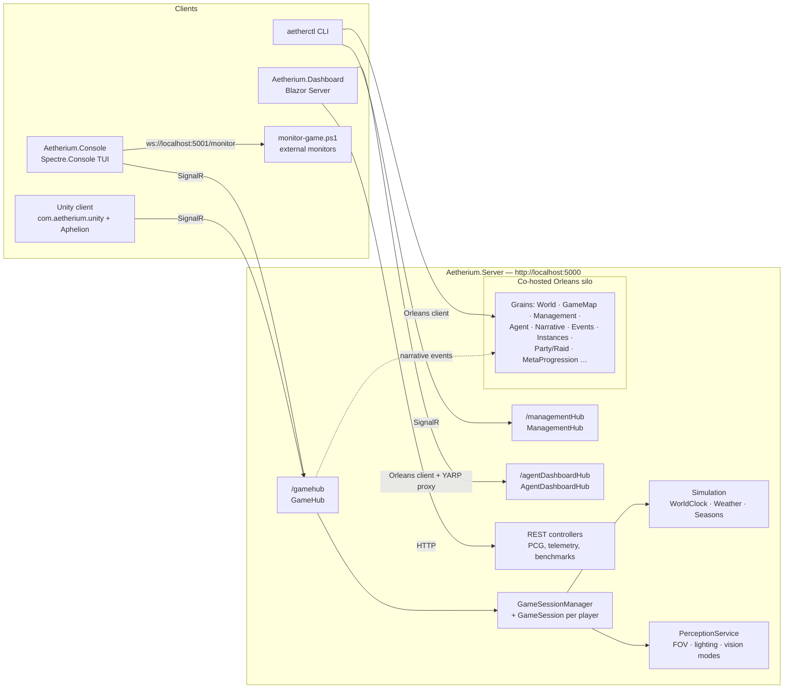

# Aetherium Architecture Overview

*Last updated: 2026-07-19*

Aetherium is a server-authoritative multiplayer simulation engine — a substrate for many games rather than one. A single ASP.NET Core process hosts the game engine, an Orleans silo, and three SignalR hubs; clients render only the perception data the server chooses to send them. Games are defined as data (YAML bundles under `Data/Games/`, each instantiable as any number of concurrent worlds), so the same engine runs a dungeon crawler, a sci-fi station crawler, or a walkable H3 planet. The server also serves as a platform for LLM-driven agents (a unified "tool" API is shared by human players and AI agents) and for procedural-content-generation (PCG) experimentation and agent training.

## Runtime topology

Key properties:

- **Server-authoritative perception.** The server computes field-of-view, lighting, and vision modes per player and pushes a `PerceptionDto` after every action. Clients never receive absolute world coordinates or state outside the player's perception (`GameStateDto` carries only player ID and heading).
- **One protocol, many clients.** Console, Unity, and the planned Unreal client all speak the same SignalR contract defined by the DTOs in `Aetherium.Model`.
- **Unified tool API.** Player actions and AI-agent actions go through the same `ExecuteTool(toolId, args)` entry point on `GameHub`, backed by a reflection-discovered tool registry with capability-based access profiles. (Legacy per-action hub methods still exist but are `[Obsolete]`.)
- **Orleans for distribution.** Multi-world hosting, instances, agents, narrative state, events, and telemetry are Orleans grains; SignalR uses `UFX.Orleans.SignalRBackplane` so hubs scale with the cluster. Orleans can be disabled entirely with `DISABLE_ORLEANS=1` (used by tests); the classic single-session path through `GameSessionManager` still works without it.

## Solution structure

| Project | Role | Depends on |
|---|---|---|
| `Aetherium.Model` | Shared DTO contracts (perception, inventory, tools, management, events, groups, instances, worlds) | Orleans.Sdk (for serialization attributes) |
| `Aetherium.Server` | Game engine + ASP.NET Core host + Orleans silo. All game logic: ECS core, simulation, perception, worldgen, combat, flight, economy, agents, narrative, multiworld | Model |
| `Aetherium.Client` | Reusable .NET client library: SignalR connection lifecycle, perception subscription, session resume. Consumed by the Unity package and future clients | Model |
| `Aetherium.Console` | Terminal client + monitoring WebSocket server | Model |
| `com.aetherium.unity` | Reusable Unity client package (grid/depth rendering, follow camera, tile themes); vendors `Aetherium.Client.dll`. Under `clients/unity/`, not in the .sln | Client (as DLL) |
| `samples/unity/Aphelion` | Co-op sci-fi station/planet-crawler sample game wiring the Unity package to a live server | com.aetherium.unity |
| `Aetherium.Unity` | Legacy Unity 2D scaffold (own "Lite" DTO shims; not part of the .sln build) — superseded by the package + sample above | — (protocol-compatible via JSON) |
| `Aetherium.Dashboard` | Blazor Server ops/training dashboard | Model, Server (Orleans client), WorldGenCLI |
| `Aetherctl` | Operator CLI (System.CommandLine), talks Orleans + SignalR + HTTP + WebSocket | Model, WorldGenCLI |
| `WorldGenCLI` | PCG API client library (used by Aetherctl and Dashboard; not a standalone tool) | — |
| `Aetherium.Test` | Engine/server tests (xUnit + NUnit, Orleans TestingHost) | Server, Model |
| `Aetherium.Client.Tests` | Client-library tests (in-proc integration suite) | Client, Server |
| `Aetherctl.Test` | CLI tests | Aetherctl |

The server has grown well past its 2026-07-03 size (then ~348 C# files / ~41.5k lines) with the combat, flight/depth, H3-planet, economy, cognition, and persistence work; treat any hard file/line counts below as approximate.

## The perception loop (core data flow)

1. Client sends an action — `ExecuteTool("move", {direction})` (or a legacy hub method) over `/gamehub`.
2. `GameHub` resolves the caller's `GameSession` via `GameSessionManager` and validates the action.
3. The action mutates authoritative world state (`World`, entities, components) and emits `WorldEvent`s; `GameHub` forwards interaction events to the narrative consequence engine (best-effort).
4. `PerceptionService` recomputes what the player can perceive: FOV (shadow-casting), lighting (torch/lantern/sunlight modes, time-of-day via `WorldClock`), vision modes (normal/infrared/echolocation), directional cone if enabled.
5. The server pushes `ReceivePerceptionUpdate(PerceptionDto)` — visible tiles, entities, inventory, affordances — and the client re-renders.

Interactive objects surface as **affordances** (available actions with required keys/targets), so clients render possibilities without knowing game rules.

## Major subsystems

Detailed in [server.md](server.md), [clients.md](clients.md), and [tooling-and-data.md](tooling-and-data.md):

| Subsystem | Where | One-liner |
|---|---|---|
| ECS core | `Aetherium.Server/Core`, `Components`, `Entities` | Entities composed from ~52 component types; ~39 entity kinds |
| Grid topology | `Aetherium.Server/Topology` | Pluggable per-world tilings (square/hex/triangle/H3) behind `IGridTopology`, threaded via `world.topology` |
| Simulation | `Aetherium.Server/Simulation` | WorldClock, seasons, weather, spawn manager, temporal modifiers; `WorldTickService` drives the world tick when Orleans is enabled |
| Perception & FOV | `Aetherium.Server/Perception`, `Lighting`, `PerceptionService.cs` | Shadow-casting FOV, lighting modes, infrared/heat trails, directional cone, **interoception** self-sense, optional **3D multi-Z slab** with flight envelope, sphere-native H3 FOV/lighting |
| World generation | `Aetherium.Server/WorldGen` (~86 files), `WorldBuilders` | Generator pipeline (phases → features → passes → validation); **H3 sphere generators** (terrain, rivers, settlements, roads, transit, satellites); prefabs, map standards |
| Combat & death | `Aetherium.Server/Combat` | Damage pipeline, downed/death states, corpse expiry, combat stats; `AttackTool` |
| Flight & depth | `Aetherium.Server/Flight`, `Components/Flight*.cs` | Altitude bands, flight plans (patterned/adhoc/scheduled/manual), land/takeoff, 3D occluded perception, flyer interaction (hack/summon/attack) |
| Economy, satellites & transit | `Aetherium.Server/Economy`, `Satellites`, WorldGen transit | Biome producers/consumers → markets trading on the road/rail graph; orbiting satellites (radio-gated detection + hacking); rail + subway transit across bands |
| Cognition | `Aetherium.Server/Components/Memory*.cs`, `Recognition*`, `Core/*Policy.cs` | Character memory (perception-time recording + read API), memory dynamics (reinforce/forget), individual recognition |
| Interaction & inventory | `Aetherium.Server/InteractionSystem.cs`, components | Pickup/drop/use/open/close, keys & locks, affordances |
| Game definitions | `Aetherium.Server/Games`, `Data/Games` | YAML game bundles (rules/content/abilities/factions/progression), each instantiable as many concurrent worlds |
| Agents & tools | `Aetherium.Server/Agents` (~45 tools) | Reflection-discovered tools (movement, interaction, vision, worldbuilding, multiworld, combat, flight, memory, quest), capability profiles, agent grains (LLM integration incomplete), prompt registry |
| Narrative | `Aetherium.Server/Narrative` | Narrative grains, consequence engine, procedural lore/graph generators; ECA visual scripting (`rules.yaml`) |
| MultiWorld & instances | `Aetherium.Server/MultiWorld`, `Instances`, `Groups`, `MetaProgression` | World directory/ACL/invites, clusters, dungeon instances, lockouts, parties/raids, cross-world progression |
| Events | `Aetherium.Server/Events` | Event scheduler + event instance grains, spawn control |
| Persistence | `Aetherium.Server/Persistence` | In-memory default; **durable SQLite** world snapshots + grain storage via `ORLEANS_STORAGE=sqlite` / `AETHERIUM_DATA_DIR` |
| Monitoring | `Aetherium.Console/Monitoring`, server telemetry | Frame streaming over WebSocket (5001), agent telemetry grain + hub + REST |
| Client rendering | `Aetherium.Console/Rendering`, `com.aetherium.unity` | `IGameRenderer` abstraction, themes, widgets, depth/cross-section views; Unity grid + depth-band renderer |
| Audio | `Aetherium.Console/Audio`, `Aetherium.Server/Audio` | NAudio-based client audio, biome audio profiles server-side |

## Endpoints & configuration

**Server** (`Aetherium.Server/Program.cs`):

| Endpoint | Purpose |
|---|---|
| `http://localhost:5000` (override with `ASPNETCORE_URLS`) | Base URL |
| `/gamehub` | Gameplay SignalR hub (optional JWT auth) |
| `/managementHub` | Admin/CLI hub (Azure AD B2C "Admin" role required for writes when auth configured) |
| `/agentDashboardHub` | Agent telemetry streaming |
| REST controllers | PCG, agent telemetry, benchmarks, curricula |
| `/dashboard` | Stub endpoint (TODO in code) |

**Console client**: monitoring WebSocket `ws://localhost:5001/monitor`, health at `http://localhost:5001/health`.

**Environment variables**:

| Variable | Effect |
|---|---|
| `DISABLE_ORLEANS=1` | Run server without the Orleans silo (test mode) |
| `ORLEANS_STORAGE=memory\|sqlite` | Grain + snapshot storage. `sqlite` (or an unset value with `AETHERIUM_DATA_DIR` set) uses durable SQLite; otherwise in-memory. The Azure Table path remains scaffolded-but-commented in `Program.cs` |
| `AETHERIUM_DATA_DIR` | Data directory for SQLite persistence; setting it defaults storage to `sqlite` |
| `PREFAB_STORAGE=file`, `PREFAB_PATH` | Prefab library file storage; prefabs load from `PREFAB_PATH` (default `./Data/Prefabs`) in Development or when `PREFAB_STORAGE=file` |
| `GAMES_PATH` | Game-definition bundle directory (default `./Data/Games`) |
| `HUB_PATH` | Hub-world JSON directory (default `./Data/Hubs`) |
| `ORLEANS_GATEWAY`, `ORLEANS_CLUSTER_ID`, `ORLEANS_SERVICE_ID` | aetherctl → Orleans connection |
| `ASPNETCORE_URLS` | Server URL override |

`appsettings.json` carries the `Simulation` section (TickHz, DayLengthMinutes, RegionSize, feature toggles for weather/seasons/agent changes/procedural events), a `Persistence` section (snapshot compaction cadence + threshold), and optional `AzureAdB2C` auth settings — auth is enabled only when Domain/ClientId/TenantId are present.

## Development workflow

- Spec-driven development via **OpenSpec**: `openspec/specs/` holds ~26 capability specs (current truth), `openspec/changes/` holds active proposals (many recently-implemented changes still await archival back into the specs). See [openspec/AGENTS.md](../../openspec/AGENTS.md).
- Dev scripts: `start-game-test.ps1` / `stop-game.ps1` (run server + console client with PID tracking), `scripts/monitor-game.ps1` / `monitor-lite.ps1` (attach to the monitoring WebSocket), `scripts/start-llm-agents.ps1`.
- Tests: `dotnet test` (see [docs/audits/README.md](../audits/2026-07-03-initial-subsystem-audit/README.md) for current ground-truth results and runtime caveats).
