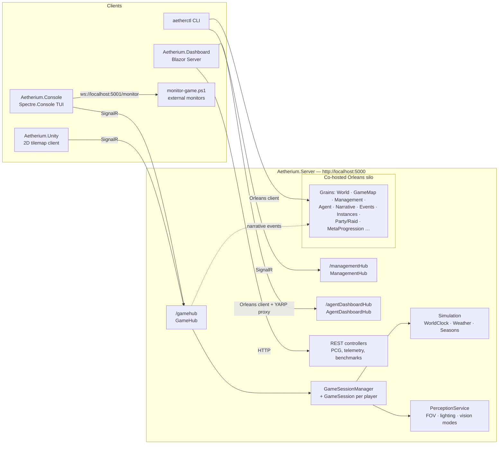

# Aetherium Architecture Overview

*Last updated: 2026-07-03*

Aetherium is a server-authoritative multiplayer dungeon crawler. A single ASP.NET Core process hosts the game engine, an Orleans silo, and three SignalR hubs; clients render only the perception data the server chooses to send them. The same server also serves as a platform for LLM-driven agents (a unified "tool" API is shared by human players and AI agents) and for procedural-content-generation (PCG) experimentation and agent training.

## Runtime topology

Key properties:

- **Server-authoritative perception.** The server computes field-of-view, lighting, and vision modes per player and pushes a `PerceptionDto` after every action. Clients never receive absolute world coordinates or state outside the player's perception (`GameStateDto` carries only player ID and heading).
- **One protocol, many clients.** Console, Unity, and the planned Unreal client all speak the same SignalR contract defined by the DTOs in `Aetherium.Model`.
- **Unified tool API.** Player actions and AI-agent actions go through the same `ExecuteTool(toolId, args)` entry point on `GameHub`, backed by a reflection-discovered tool registry with capability-based access profiles. (Legacy per-action hub methods still exist but are `[Obsolete]`.)
- **Orleans for distribution.** Multi-world hosting, instances, agents, narrative state, events, and telemetry are Orleans grains; SignalR uses `UFX.Orleans.SignalRBackplane` so hubs scale with the cluster. Orleans can be disabled entirely with `DISABLE_ORLEANS=1` (used by tests); the classic single-session path through `GameSessionManager` still works without it.

## Solution structure

| Project | Role | Depends on |
|---|---|---|
| `Aetherium.Model` | Shared DTO contracts (perception, inventory, tools, management, events, groups, instances, worlds) | Orleans.Sdk (for serialization attributes) |
| `Aetherium.Server` | Game engine + ASP.NET Core host + Orleans silo. All game logic: ECS core, simulation, perception, worldgen, agents, narrative, multiworld | Model |
| `Aetherium.Console` | Terminal client + monitoring WebSocket server | Model |
| `Aetherium.Unity` | Unity 2D client (own "Lite" DTO shims; not part of the .sln build) | — (protocol-compatible via JSON) |
| `Aetherium.Dashboard` | Blazor Server ops/training dashboard | Model, Server (Orleans client), WorldGenCLI |
| `Aetherctl` | Operator CLI (System.CommandLine), talks Orleans + SignalR + HTTP + WebSocket | Model, WorldGenCLI |
| `WorldGenCLI` | PCG API client library (used by Aetherctl and Dashboard; not a standalone tool) | — |
| `Aetherium.Test` | Engine/server tests (xUnit + NUnit, Orleans TestingHost) | Server, Model |
| `Aetherctl.Test` | CLI tests | Aetherctl |

Sizes (2026-07-03): Server ~348 C# files / ~41.5k lines; Console ~100 / ~11.3k; Test ~93 / ~19.6k; Unity ~21 / ~2k; Model 20 / ~1.2k; Aetherctl 16 / ~3.7k; WorldGenCLI 14 / ~1.1k; Dashboard 5 / ~0.5k.

## The perception loop (core data flow)

1. Client sends an action — `ExecuteTool("move", {direction})` (or a legacy hub method) over `/gamehub`.
2. `GameHub` resolves the caller's `GameSession` via `GameSessionManager` and validates the action.
3. The action mutates authoritative world state (`World`, entities, components) and emits `WorldEvent`s; `GameHub` forwards interaction events to the narrative consequence engine (best-effort).
4. `PerceptionService` recomputes what the player can perceive: FOV (shadow-casting), lighting (torch/lantern/sunlight modes, time-of-day via `WorldClock`), vision modes (normal/infrared/echolocation), directional cone if enabled.
5. The server pushes `ReceivePerceptionUpdate(PerceptionDto)` — visible tiles, entities, inventory, affordances — and the client re-renders.

Interactive objects surface as **affordances** (available actions with required keys/targets), so clients render possibilities without knowing game rules.

## Major subsystems

Detailed in [server.md](server.md), [clients.md](clients.md), and [tooling-and-data.md](tooling-and-data.md):

| Subsystem | Where | One-liner |
|---|---|---|
| ECS core | `Aetherium.Server/Core`, `Components`, `Entities` | Entities composed from ~48 component types; 33 entity kinds |
| Simulation | `Aetherium.Server/Simulation` | WorldClock, seasons, weather, spawn manager, temporal modifiers |
| Perception & FOV | `Aetherium.Server/Perception`, `Lighting`, `PerceptionService.cs` | Shadow-casting FOV, lighting modes, infrared/heat trails, directional cone |
| World generation | `Aetherium.Server/WorldGen` (~81 files), `WorldBuilders` | Generator pipeline (phases → features → passes → validation), prefabs, map standards |
| Interaction & inventory | `Aetherium.Server/InteractionSystem.cs`, components | Pickup/drop/use/open/close, keys & locks, affordances |
| Agents & tools | `Aetherium.Server/Agents` (~50 files) | 31 reflection-discovered tools, capability profiles, agent grains (integration incomplete), prompt registry |
| Narrative | `Aetherium.Server/Narrative` | Narrative grains, consequence engine, procedural lore/graph generators |
| MultiWorld & instances | `Aetherium.Server/MultiWorld`, `Instances`, `Groups`, `MetaProgression` | World directory/ACL/invites, clusters, dungeon instances, lockouts, parties/raids, cross-world progression |
| Events | `Aetherium.Server/Events` | Event scheduler + event instance grains, spawn control |
| Monitoring | `Aetherium.Console/Monitoring`, server telemetry | Frame streaming over WebSocket (5001), agent telemetry grain + hub + REST |
| Client rendering | `Aetherium.Console/Rendering`, Unity `Assets/Scripts` | `IGameRenderer` abstraction, themes, widgets; Unity tilemap renderer |
| Audio | `Aetherium.Console/Audio`, `Aetherium.Server/Audio` | NAudio-based client audio, biome audio profiles server-side |

## Endpoints & configuration

**Server** (`Aetherium.Server/Program.cs`):

| Endpoint | Purpose |
|---|---|
| `http://localhost:5000` (override with `ASPNETCORE_URLS`) | Base URL |
| `/gamehub` | Gameplay SignalR hub (optional JWT auth) |
| `/managementHub` | Admin/CLI hub (Azure AD B2C "Admin" role required for writes when auth configured) |
| `/agentDashboardHub` | Agent telemetry streaming |
| REST controllers | PCG, agent telemetry, benchmarks, curricula |
| `/dashboard` | Stub endpoint (TODO in code) |

**Console client**: monitoring WebSocket `ws://localhost:5001/monitor`, health at `http://localhost:5001/health`.

**Environment variables**:

| Variable | Effect |
|---|---|
| `DISABLE_ORLEANS=1` | Run server without the Orleans silo (test mode) |
| `ORLEANS_STORAGE=memory` | Grain storage; **note:** the `azure` path is currently commented out in `Program.cs` — only memory storage works |
| `PREFAB_STORAGE=file`, `PREFAB_PATH` | Prefab library file storage (loading currently a TODO) |
| `HUB_PATH` | Hub-world JSON directory (default `./Data/Hubs`) |
| `ORLEANS_GATEWAY`, `ORLEANS_CLUSTER_ID`, `ORLEANS_SERVICE_ID` | aetherctl → Orleans connection |
| `ASPNETCORE_URLS` | Server URL override |

`appsettings.json` carries the `Simulation` section (TickHz, DayLengthMinutes, RegionSize, feature toggles for weather/seasons/agent changes/procedural events) and optional `AzureAdB2C` auth settings — auth is enabled only when Domain/ClientId/TenantId are present.

## Development workflow

- Spec-driven development via **OpenSpec**: `openspec/specs/` holds 20 capability specs (current truth), `openspec/changes/` holds active proposals. See [openspec/AGENTS.md](../../openspec/AGENTS.md).
- Dev scripts: `start-game-test.ps1` / `stop-game.ps1` (run server + console client with PID tracking), `scripts/monitor-game.ps1` / `monitor-lite.ps1` (attach to the monitoring WebSocket), `scripts/start-llm-agents.ps1`.
- Tests: `dotnet test` (see [docs/audits/README.md](../audits/2026-07-03-initial-subsystem-audit/README.md) for current ground-truth results and runtime caveats).
