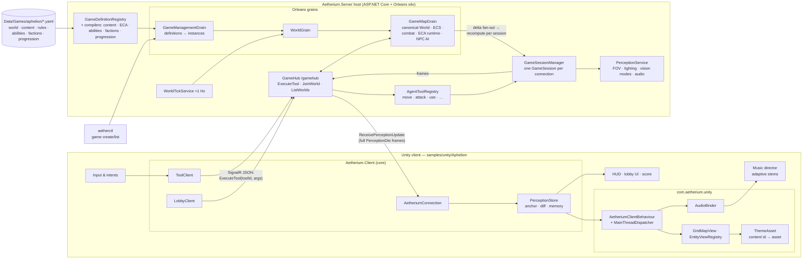
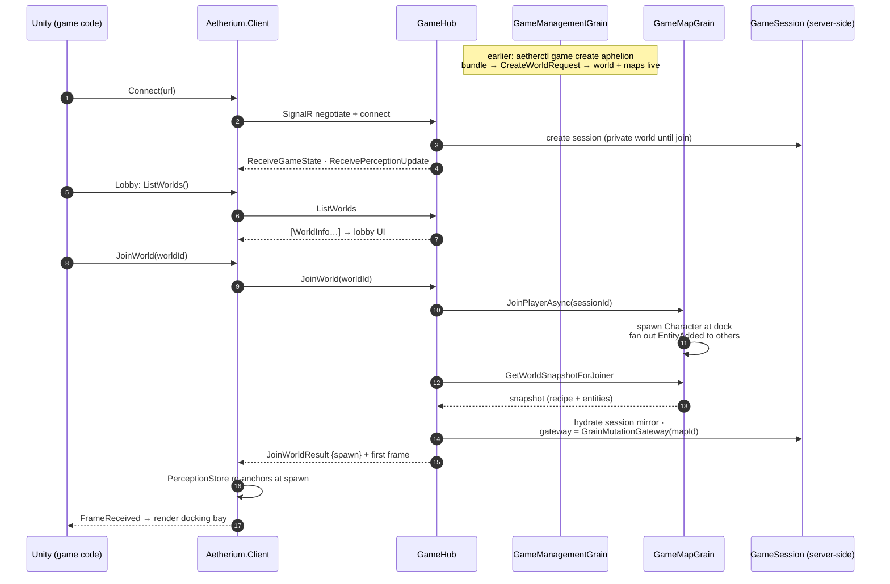
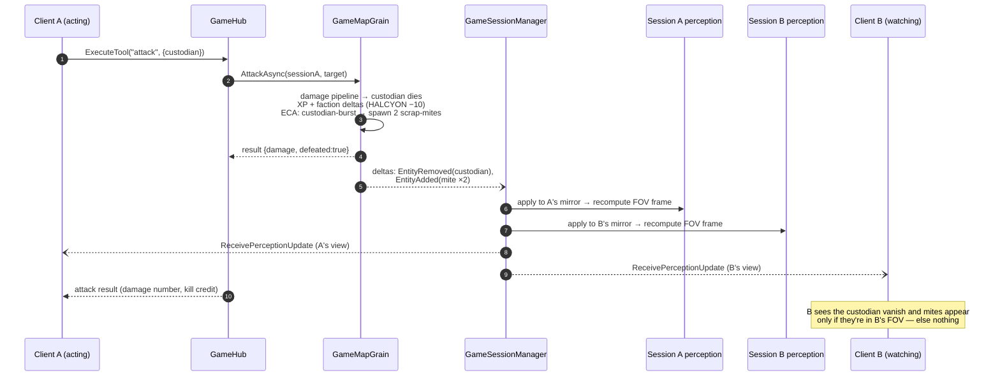
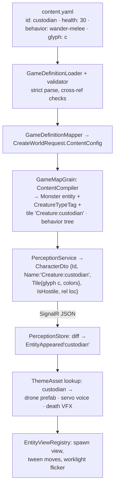

# Architecture: Unity Client ↔ Aetherium Server

*Part of the [Unity sample design suite](README.md). Status: proposed design; server-side elements shown are shipped unless marked as gaps.*

This is the end-to-end picture: how the Aphelion Unity client's subsystems relate to the Aetherium server/cluster's subsystems, what flows over the wire, and how the same architecture spans one laptop or a cloud cluster. Component internals: [unity-client-library.md](unity-client-library.md). Server internals: [docs/architecture/server.md](../../architecture/server.md).

## The one-diagram version

Server-authoritative, perception-based, data-driven: the server simulates everything and streams each player a *view*; the client turns views into light and sound; a YAML bundle defines what any of it means.

The load-bearing properties:

1. **No rules on the client.** The Unity side contains zero game logic — damage, deaths, ECA reactions, faction standing all resolve in `GameMapGrain`. The client can be wrong about nothing; at worst it renders late.
2. **The wire is views, not state.** Clients receive only what their character perceives (FOV, lighting, vision mode), always player-relative. Two co-op partners get *different* frames from the same mutation.
3. **Meaning and presentation meet at content ids.** The bundle names things (`custodian`, `arc-cutter`, `burning`); perception carries those ids; the ThemeAsset binds them to prefabs and sounds. Adding a creature to the game = one YAML block + one theme row.

## Sequence: session bootstrap

A client may skip the lobby by connecting with `?worldId=<id>` in the query string — the hub auto-joins on connect. That's the "join my friend's station" deep-link path.

## Sequence: the co-op loop (one action, two players)

What makes multiplayer *feel* shared: any mutation on the map re-renders everyone on it, each through their own perception.

The same fan-out path carries NPC behavior: `WorldTickService` (≈1 Hz) ticks each world → `GameMapGrain.StepNpcsAsync()` runs behavior trees → movement/attack deltas → fresh frames to whoever can perceive them. **If nothing changes near you, no frames arrive** — an idle dark corridor costs no bandwidth, and the client's ambient beauty (dust, hum, music) is deliberately self-sustaining between frames.

## Data flow: from YAML to pixels

The full life of one line of game data — the row `custodian` — across every boundary:

Three different consumers read the same id at different stages: the **validator** (is `custodian` referenced by spawns/loot/rules real?), the **ECA runtime** (`creature_type_is: custodian`), and the **theme** (which prefab?). One name, defined once, in data.

## Deployment topologies

The client is topology-blind — it sees one URL. Everything below is server-side arrangement:

| Topology | Arrangement | Use |
|---|---|---|
| **Dev laptop** | One `Aetherium.Server` process (co-hosted silo), Unity editor pointed at `http://localhost:5000`. Anonymous auth. `aetherctl game create aphelion` to stand up a station. | Daily development; the M0 default |
| **LAN co-op** | Same single process, friends connect to the host's LAN address (`ASPNETCORE_URLS` bind). | Playtests; M0 acceptance runs |
| **Cloud** | Multiple silos, Orleans clustering; SignalR scales across silos via the already-referenced `UFX.Orleans.SignalRBackplane` (a client's hub connection can land on any host while its map grain lives on another). JWT auth (Azure AD B2C) switches on via config — the same `GameClient` policy the hub already carries; the client library's token provider fills the gap. Grain persistence currently memory-only — durable storage is a known engine-level TODO, orthogonal to this design. | Later; nothing in the client design changes |

Management stays a separate plane in all topologies: `aetherctl`/REST (API-key gated in prod) create and operate worlds; the game client only lists/joins.

## Performance & responsiveness model

- **Action feedback:** full round-trip (input → grain → fresh frame) targets the protocol spec's ≤100 ms on LAN. Presentation starts on input (wind-ups, sounds); state changes only on server confirmation.
- **Frame sizes:** a full perception frame for a 15×11 view with a handful of entities is a few KB of JSON; at human action rates plus 1 Hz ambient ticks this is trivially cheap. If it ever isn't (spectating dense fights), the lever is server-side — FOV-filtered delta fan-out is already spec'd as a future phase — with no client API change (the store already consumes diffs it computes itself).
- **Smoothness between 1 Hz world ticks:** entity tweens are timed to the observed inter-frame gap; the game reads as deliberate, weighty motion (fitting the fiction) rather than as lag. Player's own actions round-trip much faster than the tick, so *you* always feel immediate.
- **Reconnects:** `WithAutomaticReconnect` + rejoin flow (the session's world binding survives brief drops; on new session, the lobby re-join path re-anchors cleanly).

## Trust & failure model

- The client is untrusted by construction — it can only invoke player-profile tools on its own session; world-edit/admin tools are profile-blocked at the hub (`AgentToolProfile.Player`), and the management plane runs on a different hub/REST surface with its own auth.
- Server restarts: Orleans grains reactivate from persisted state (map state, content/ECA configs re-compile on activation — the shipped reactivation path); clients reconnect and rejoin. With memory-only storage today, a full host restart means fresh worlds — acceptable for the sample's session-length runs.
- Client crashes/disconnects: the hub removes the player character from the map (others see them leave); rejoining spawns fresh at the dock.
