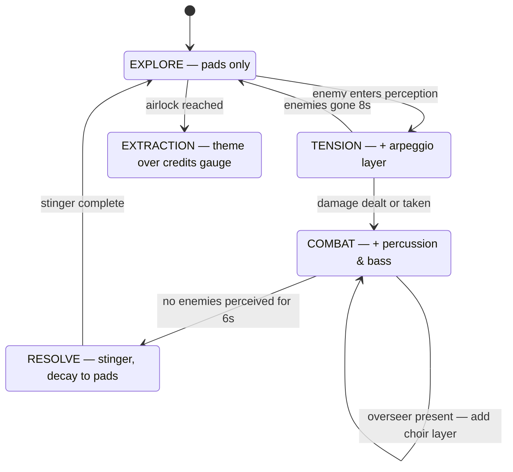

# Aphelion — Art & Audio Direction

*Part of the [Unity sample design suite](README.md). Status: proposed design, not yet implemented.*

One sentence of art vision: **a cold station remembering warmth**. Darkness is the canvas; light is the paint. Every beautiful thing in Aphelion — bloom-hot emissives, a suit lamp's cone, a gas giant sliding past a viewport — exists to make the engine's light-and-perception simulation *felt*.

This document is the presentation-side contract: the game's meaning lives in `Data/Games/aphelion/` YAML; everything below lives in the Unity project and binds to bundle content ids through theme assets ([unity-client-library.md](unity-client-library.md)).

## Platform baseline

- **Unity 6 LTS** (the legacy scaffold project is already on 6000.4), **URP** (already 17.4 in-repo), Forward+ rendering, post-processing via URP Volume.
- Performance budget: 60 fps on integrated laptop GPUs at 1080p. Concretely: ≤ 16 real-time lights on screen (Forward+ handles this comfortably), ≤ 2k particles sustained, single skybox pass, no real-time shadows from point lights (spot/directional only, low resolution).

## Visual direction

### Camera & perspective

Three-quarter top-down **perspective** camera: ~50° tilt, ~35° FOV, distance-framed so roughly 15×11 grid cells are on screen (matching typical perception bounds). Perspective (not orthographic) is deliberate: it gives parallax through windows to the space backdrop, depth to wall pieces, and drama to tall props — while staying grid-readable. Camera follows the player pawn with soft damping and a subtle combat shake budget (2–3 px, never more).

### Why low-poly 3D (not sprites)

1. **Lighting is the pillar.** The engine computes per-cell light levels and vision modes; real-time URP lights + emissive materials + bloom express that better than any 2D approximation, at a fraction of the shader effort.
2. **Procedural stations demand a modular kit.** A dozen reusable meshes cover every station the generator produces; 2D would need directional sprite sets per tile context.
3. **No art-skill bottleneck.** Chunky low-poly with flat colors + emissive trim looks *intentional* and ships fast; quality scales later by swapping meshes, not reworking the approach.

### The modular station kit (M0 scope: ~14 meshes)

| Piece | Notes |
|---|---|
| Floor plate ×3 variants | grid-aligned, subtle tread pattern, vertex-color tint per zone |
| Wall segment / corner / T | emissive conduit strip along the top edge |
| Bulkhead door | sliding iris, animated open/close, emissive lock ring (red locked / amber unlocked / green open) |
| Window wall | hull frame + transparent pane; the *money piece* — space visible behind |
| Lift pad | z-level transition marker, glowing chevrons |
| Console / crate / pipe stack / hydroponic rack | props for custodial, cargo, and Bloom-touched rooms |
| Docking bay set | spawn/extraction landmark: clamps, warning stripes, the *Meridian*'s umbilical |

Creatures and the Reclaimer come from the committed CC0 model set ([assets.md](assets.md)), re-materialed to the palette with **strong silhouettes and one emissive identifier each** (readability at small scale is the test):

- **Scrap Mite** — palm-size tri-leg chip, single amber eye, skittering hop.
- **Custodian** — barrel body, too many folding arms, flickering worklight.
- **Sentinel** — tall, angular, a single red visor line; moves like it's owed something.
- **Vent Lurker** — sinuous quadruped, matte black, bioluminescent teal seams (bright on IR).
- **Overseer Node** — armored pillar with slowly rotating rings; the room's light dims toward it.
- **Reclaimer** — bulky suit, backpack, head-lamp; palette-swappable accent stripe per player.

### Animation: two motion languages

Characters are fully 3D and animate as they walk and act — with the motion style split by fiction, which happens to match the assets exactly:

- **Organics and suited characters** (Reclaimers, Vent Lurker, future Bloom creatures) use **skeletal animation** — the committed models carry full clip sets (the astronauts ship 18 clips: Idle/Walk/Run, gun variants, Punch, HitReact, Death, plus Wave/Yes/No, which become co-op ping emotes; the Overseer mech has Walk/Run/Shoot_Big/Kick/Death). An Animator state machine per creature is driven by the client library's entity events: `EntityMoved` plays Walk/Run with playback speed synced to the tween, attack results trigger Punch/Shoot and HitReact on the target, a kill-vanish plays Death before the dissolve, idle time plays Idle with random offsets so crowds don't metronome.
- **Machines** (Scrap Mite, Custodian, Sentinel) use **procedural transform animation** — hover bob, body roll into turns, servo-stepped rotation, stagger on hit, seizure-flicker at Critical condition. Rigid bodies moving rigidly is the *correct* read for feral drones, needs no rig, and gives the machines an uncanny stiffness that contrasts with the organics' fluidity.

All clips play in place (no root motion); the PerceptionStore's grid tween owns position, animation owns everything else.

### Palette

Deep space blue-black base (`#0B0E14`), desaturated hull neutrals, and **three emissive accent families** that double as faction storytelling:

| Family | Colors | Where |
|---|---|---|
| HALCYON warmth | amber `#FFB454`, warm white | restored power, safe rooms, custodial fixtures |
| AEGIS threat | signal red `#FF3B4E`, magenta | lockdown lights, sentinels, hazard stripes |
| Bloom | bio-teal `#3EF0C5`, deep green | overgrown sections, lurker seams |

Player-facing feedback colors sit outside those families: burning = ember orange, slowed = cryo cyan, healing = soft green pulse. Post stack: bloom (the effect) tuned so only emissives glow, gentle vignette, fine film grain, and a teal-shadow/amber-highlight color grade — cold world, warm light.

### Rendering the perception model

The server decides *what you perceive*; the client decides *how it feels*. The mapping, per perception field:

- **Per-cell light level (0–1)** → each cell's ambient contribution (vertex-lit floor tint) plus placed light sources at bright cells. The player's own lamp is a real spotlight child of the pawn — it doesn't change gameplay (the server already computed visibility); it makes the *reason* for visibility legible.
- **Unexplored cells** → pure black void (station exterior reads through window pieces only).
- **Explored-but-not-visible** (client-side memory of last-seen state) → desaturated, darkened "memory" render of the last known terrain, no entities. The engine sends only current perception; remembered geometry is presentation state, clearly distinguished so players never mistake memory for truth.
- **Infrared mode** → full-screen shader: geometry drops to cold blues, entities and **heat trails** (the engine streams these as deltas) render as thermal blobs that cool over seconds. This is a shipped engine feature no client has done justice yet — in Unity it's the signature visual.
- **Echolocation mode** → near-black with an expanding ping ring that briefly edge-lights geometry (sonar sketch), then fades.
- **Statuses** → material overlays: burning adds ember particles + heat shimmer; slowed adds a crystalline cyan sheath and pitch-drops that entity's audio.

### VFX set (M0 → M1)

M0: suit-lamp cone (soft cookie + dust motes in the beam), melee hit spark, mite pop burst (parts + one bright flash — it's a *gameplay event*, the ECA rule deals damage), drone death burst (parts, smoke puff, brief light), door-open steam hiss, damage numbers (small, crisp, additive).
M1: overcharge-bolt beam (the screen's brightest moment, with capacitor-whine buildup), stasis-snare dome (refractive bubble), overseer death sequence (ring separation, deck lights stutter, then the death-rattle sentinels spawn in on columns of red light), floating debris in breached rooms.

### The window

Every station seed picks a backdrop: gas giant with ring shadow, ochre desert planet, or the star itself, dim and huge at aphelion. Implemented as a skybox + one slowly rotating body (shader, not geometry). Windows are why the camera is perspective — the parallax as you walk past a viewport is the cheapest awe in the game. The docking bay always faces the backdrop; extraction is framed as walking into that view.

### UI

Diegetic-flavored suit HUD: visor-corner frames, charge/stamina as suit gauges, compass strip (the protocol provides heading), inventory as a backpack panel, subtle scanline on HUD elements only. Typeface: a clean geometric sans (license-clean, e.g. Inter). Menus reuse the palette — amber on space-black, red reserved for warnings only.

## Audio direction

Philosophy: **the station is the soundtrack.** Music stays out of the way until the game earns it; the ambient bed does the emotional work.

### Layers

1. **Room tone** (always): reactor sub-hum (low), HVAC hiss (mid), randomized distant metal groans and relay clicks (sparse one-shots, 3D-positioned). Bloom-touched areas add a wet, organic underlayer.
2. **Positional SFX**: footfalls (deck-plate ring), door servo + pressure hiss, pickup chime, weapon reports, hit impacts, creature voices (mite chitter, custodian servo-mutter, sentinel klaxon-chirp, lurker breath). All routed through Unity's spatializer with rolloff tuned tight — hearing a lurker *somewhere to the left* is gameplay.
3. **Status & state**: burning crackle loop, stasis shimmer, down-state heartbeat + muffle filter (low-pass sweep on the whole mix), revive swell.
4. **Adaptive music** (see below).

### Adaptive music

Layered-stem system on Unity's AudioMixer — no middleware (FMOD/Wwise are deliberately avoided to keep the sample dependency-free and license-simple).

All transitions are crossfades on beat-safe boundaries (stems authored at one tempo, 4-bar loops). Style: analog synth, slow-attack pads, warm against the cold visuals; the extraction theme is the one melodic earworm the game allows itself.

The state machine's inputs are a **blend of server hints and client inference** — and the server half already exists: every `PerceptionDto` carries an `Audio` payload (`Biome`, `DangerLevel`, `ReverbPreset`, `Occlusion`, positioned `AmbientEmitters`, `SuggestedMusicTrack`, `FootstepMaterial`), produced by the worldgen audio pass and the perception service. Aphelion binds room tone to `Biome`, footfall sets to `FootstepMaterial`, reverb/occlusion sends to the mixer, and treats `DangerLevel`/`SuggestedMusicTrack` as advisory inputs to the state machine — while the Explore→Tension→Combat edges stay client-side (driven by visible enemies and combat results) so music reacts within a frame, not a server round-trip.

### Asset sourcing & licensing (repo rules)

The concrete sourcing plan — which packs, which pieces are made in-project, and the code-generated music pipeline — lives in [assets.md](assets.md); the first slice is committed with per-file provenance in the project's [ATTRIBUTIONS.md](../../../samples/unity/Aphelion/ATTRIBUTIONS.md). The rules:

The sample's assets are **committed to the repo**, so licensing is a hard gate, not a preference:

- **CC0 only** for anything committed (Kenney packs, OpenGameArt/freesound filtered to CC0). No CC-BY in-repo, no "royalty-free" packs whose licenses forbid redistribution in source form (that excludes most commercial SFX libraries — e.g. Sonniss GDC packs are usable in builds but not redistributable as files, so they're out).
- Music stems are **authored for the project** (simple DAW/synth work) or CC0 — committed as short OGG loops, small.
- `samples/unity/Aphelion/ATTRIBUTIONS.md` lists every imported asset with source URL and license, enforced by review convention.
- Everything else (meshes, materials, VFX, UI) is **made in-project** — the low-poly direction makes that realistic.

## Beauty milestones (what "it looks good" means, per milestone)

| Milestone | The screenshot test |
|---|---|
| **M0** | A dark corridor, one amber conduit light, suit-lamp cone with dust motes, a custodian's worklight approaching, bloom + grade active, room tone + footsteps + one music layer. *One* screenshot that sells the whole game. |
| **M1** | IR mode with cooling heat trails; overcharge-bolt beam; adaptive music through the full state graph; the window vista with a turning gas giant. |
| **M2** | Overseer death sequence with deck-light stutter; Bloom biome dressing; extraction framing shot into the backdrop; co-op revive tableau (two lamps crossing in the dark). |
