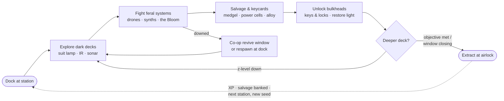

# Aphelion — Game Design

*Part of the [Unity sample design suite](README.md). Status: proposed design, not yet implemented.*

**Aphelion** is the sci-fi sample game for Aetherium: a co-op salvage crawl through massive space stations at the cold end of a decades-long orbit. Where Emberfall proves the fantasy bundle and Neonveil proves single-file authoring (both are bundle-only, rendered by the console client), Aphelion is the first sample with a **bespoke visual client** — the working proof that Aetherium games are *data plus presentation*: the entire meaning of Aphelion lives in a YAML bundle at `Data/Games/aphelion/`, and everything a player sees and hears lives in a Unity project at `samples/unity/Aphelion/`.

## Premise

The **Aphelion Chain** is a string of mega-stations threaded along a grand elliptical orbit — some swinging past planets, the farthest arcing out into the dark between them. Near perihelion the Chain thrives on starlight; then comes the **Long Dark**, the decades-long outbound leg, when every station drops to skeleton power and hibernates.

This time, the hibernation went wrong. Custodial drone-minds spent thirty years self-repairing with no one to tell them what "repair" means. Security subsystems locked down decks against threats that no longer exist — or that do. Breached bio-domes let an engineered ecology, the **Bloom**, grow strange in the dark.

You are a **Reclaimer** riding the cycler ship *Meridian* as the Chain finally swings sunward. At each station you dock, go aboard, bring the power back deck by deck, put down what the dark made, salvage what you can, and get back to the airlock before the *Meridian*'s departure window closes.

The tone is **lonely-beautiful, not horror**: the hum of a reactor waking up, warm light spilling down a dead corridor, a gas giant turning slowly past the viewport. Dread comes from darkness and scarcity, relief comes from light — which is exactly the axis the engine's FOV/lighting simulation plays on.

## Design pillars

1. **Light is the resource.** The engine simulates FOV, light levels, and vision modes per player. Aphelion makes that the game: dark decks are dangerous, your suit lamp is a cone of safety, restoring power floods a corridor with light and *changes the gameplay* there. Infrared mode reveals drone heat-trails; sonar (echolocation mode) sketches geometry in the void. Nothing here is new engine work — it is the perception stack, finally rendered by a client that can do it justice.
2. **The station is the character.** Every run is a different station: same bundle, different world seed. Procedural decks (z-levels), locked bulkheads, salvage caches. The player's mental loop is *read the station → plan a route → survive the detour*.
3. **Simple verbs, reactive world.** Move, attack, use, pick up, open — the verbs the engine already serves. Depth comes from the ECA rule layer: custodians burst into scrap-mites, sentinels die with a system-shock pulse, an overseer's death rattle summons its guards. The world visibly *reacts*, and every reaction is a data rule any modder can read.
4. **Drop-in co-op from day one.** Two Reclaimers who join the same station see each other, fight together, and revive each other (down-state is a bundle death-policy flag). Multiplayer is the engine's native posture, not a feature to add.
5. **Start small, stay honest.** Milestone 0 is one deck, three enemies, one weapon, one loop that is actually fun. Every expansion (bosses, objectives, hazards, economy) rides an engine capability that either exists or is on the [engine-gaps](engine-gaps.md) list with a plan.

## The core loop



A run is 15–30 minutes. The M0 win condition is client-orchestrated (reach the airlock with salvage; the score screen tallies it) while a server-side objectives section is designed as a follow-up engine slice — see [engine-gaps.md](engine-gaps.md).

## How Aphelion maps onto the engine

Every row is an existing engine capability; the game is a re-skin plus data.

| Aphelion concept | Engine capability | Where it's defined |
|---|---|---|
| A station | A world instance created from the `aphelion` bundle (unique seed per run) | `game.yaml` `world:` + instance creation |
| Decks | z-levels (`world.size.depth`), `changelevel` tool at lift/ladder tiles | `game.yaml` |
| Corridors, rooms, hull | Grid terrain from the worldgen pipeline | generator + seed |
| Bulkheads & airlocks | Doors + keys/locks + open/close affordances | engine interaction system |
| Darkness & suit lamp | Lighting simulation + light sources + FOV | engine perception |
| IR visor / sonar pulse | Vision modes (infrared, echolocation) + heat trails | engine perception (`setvisionmode`) |
| Feral drones & Bloom | Data-driven creatures with behavior presets | `content.yaml` |
| Salvage, medgel, weapons | Data-driven items (heal / weapon-bonus / carriable) | `content.yaml` |
| Reactive station events | ECA rules (`creature_died` trigger, T0 vocabulary) | `rules.yaml` |
| Reclaimer kit (abilities) | Ability system: resource pools, cooldowns, effects | `abilities.yaml` |
| Station sub-minds (factions) | Faction standings, doctrine deltas, bands | `factions.yaml` |
| Reclaimer rating (XP) | Progression pools, skills, attribute derivations | `progression.yaml` |
| Down-state revives, respawn at dock | Per-world death policy | `game.yaml` `death:` |
| Co-op | Multi-session map grains + delta fan-out + cross-session visibility | engine multiplayer |

## The bundle, drafted

The following is the intended launch content of `Data/Games/aphelion/` — real syntax against the shipped loader (same section files as Emberfall), trimmed here only for readability. Content ids are the shared vocabulary with the Unity client's theme assets ([unity-client-library.md](unity-client-library.md)).

### `game.yaml` — manifest, world, death policy

```yaml
id: aphelion
name: Aphelion
version: 0.1.0
description: >
  A co-op salvage crawl through hibernating mega-stations at the cold end
  of a decades-long orbit. Bring the light back. Mind what grew in the dark.
tags: [scifi, station-crawler, coop, sample]

world:
  generatorType: maze            # M0 stand-in; "station" generator is a proposed engine slice
  size: { width: 72, height: 72, depth: 3 }   # three decks
  maxPlayers: 8

death:
  permadeath: false
  downStateEnabled: true         # co-op revives
  reviveWindowTicks: 8
  respawnInvulnerabilityTicks: 3
  corpseRetentionTicks: 600
  dropOnDeath: Partial
  respawnLocation: { mode: WorldSpawn }   # the docking bay
  xpLossPolicy: None
```

### `content.yaml` — the cast and the kit

Five creatures arranged in a clean threat ladder, each with a distinct silhouette, sound, and death-reaction; six items covering heal / weapon / salvage roles.

```yaml
creatures:
  - id: scrap-mite
    name: Scrap Mite
    description: Palm-sized repair swarmer gone feral. Pops when struck.
    glyph: m            # console fallback; Unity binds id -> prefab
    color: DarkGray
    health: 8
    attackPower: 2
    speed: 1.5          # speed is the engine's action-rate multiplier (1.0 = baseline)
    behavior: wander-melee
    lootItemId: alloy-scrap

  - id: custodian
    name: Custodian
    description: Corrupted maintenance drone. Thirty years of unsupervised self-repair.
    glyph: c
    color: Yellow
    health: 30
    attackPower: 6
    speed: 1.0
    behavior: wander-melee
    lootItemId: power-cell

  - id: sentinel
    name: Sentinel
    description: AEGIS security synth still enforcing a lockdown no one ordered.
    glyph: S
    color: Red
    health: 55
    attackPower: 12
    speed: 0.9
    behavior: wander-melee
    lootItemId: charge-capsule

  - id: vent-lurker
    name: Vent Lurker
    description: The Bloom's hunter-shape. Fast, quiet, warm on infrared.
    glyph: v
    color: Green
    health: 25
    attackPower: 8
    speed: 1.4
    behavior: wander-melee

  - id: overseer-node
    name: Overseer Node
    description: A deck's governing sub-mind, armored in its own hull. The alarm dies with it.
    glyph: O
    color: Magenta
    health: 120
    attackPower: 15
    speed: 0.6
    behavior: wander-melee   # "sentry" preset is a proposed engine addition (engine-gaps)
    lootItemId: core-shard

items:
  - id: medgel
    name: Medgel Injector
    icon: "+"
    weight: 1
    heal: { amount: 30, uses: 2 }
  - id: arc-cutter
    name: Arc Cutter
    icon: "/"
    weight: 3
    weaponBonus: 8
  - id: plasma-lance
    name: Plasma Lance
    icon: "!"
    weight: 5
    weaponBonus: 15
  - id: alloy-scrap
    name: Alloy Scrap
    icon: "%"
    weight: 2
  - id: power-cell
    name: Power Cell
    icon: "*"
    weight: 2
  - id: core-shard
    name: Overseer Core Shard
    icon: "$"
    weight: 1

spawns:
  - { creatureId: scrap-mite,    weight: 5 }
  - { creatureId: custodian,     weight: 3 }
  - { creatureId: sentinel,      weight: 2 }
  - { creatureId: vent-lurker,   weight: 2 }
  - { creatureId: overseer-node, weight: 1 }
```

### `rules.yaml` — the station reacts

All four rules use the shipped T0 vocabulary (`creature_died`; `creature_type_is`, `chance`; `spawn_creature`, `deal_damage`, `apply_status`) — no new engine verbs required. Each is also a *presentation* event the client scores with VFX/audio (see [art-audio.md](art-audio.md)).

```yaml
rules:
  - id: mite-pop
    when: creature_died          # scrap-mites pop like blown capacitors
    if:
      - { kind: creature_type_is, creatureType: scrap-mite }
      - { kind: chance, probability: 0.35 }
    do:
      - { kind: deal_damage, target: Killer, damageType: energy, amount: 3 }

  - id: custodian-burst
    when: creature_died          # a custodian's swarm bays fly open
    if:
      - { kind: creature_type_is, creatureType: custodian }
      - { kind: chance, probability: 0.5 }
    do:
      - { kind: spawn_creature, creatureId: scrap-mite, offsetX: 1 }
      - { kind: spawn_creature, creatureId: scrap-mite, offsetX: -1 }

  - id: sentinel-shock
    when: creature_died          # dying feedback pulse through your suit systems
    if:
      - { kind: creature_type_is, creatureType: sentinel }
    do:
      - { kind: apply_status, target: Killer, statusId: slowed, durationTicks: 10, magnitude: 0.5 }

  - id: overseer-death-rattle
    when: creature_died          # the node's last act: summon its guards
    if:
      - { kind: creature_type_is, creatureType: overseer-node }
    do:
      - { kind: spawn_creature, creatureId: sentinel, offsetX: 2 }
      - { kind: spawn_creature, creatureId: sentinel, offsetX: -2 }
```

### `abilities.yaml` — the Reclaimer kit

Engine status ids (`burning`, `slowed`) are reused with sci-fi presentation names client-side (Overheat, System Shock).

```yaml
characterResourcePools:
  - { tag: charge,  max: 100, regenPerTick: 2, regenPolicy: Continuous }    # suit capacitor
  - { tag: stamina, max: 50,  regenPerTick: 5, regenPolicy: OutOfCombat }

abilities:
  - id: overcharge-bolt          # dump the capacitor through the cutter
    resourcePoolTag: charge
    resourceCost: 25
    cooldown: 3
    range: 6
    targetShape: single
    effects:
      - { kind: DealDamage, damageType: energy, amount: 40 }
      - { kind: ApplyStatus, statusId: burning, durationTicks: 3, magnitude: 5 }
    tags: [suit, energy]

  - id: breach-strike            # shoulder-charge with the exo-frame
    resourcePoolTag: stamina
    resourceCost: 15
    cooldown: 2
    range: 1
    targetShape: single
    effects:
      - { kind: DealDamage, damageType: physical, amount: 30 }
    tags: [exo, melee]

  - id: stasis-snare             # localized inertial damper
    resourcePoolTag: charge
    resourceCost: 30
    cooldown: 4
    range: 4
    targetShape: single
    effects:
      - { kind: ApplyStatus, statusId: slowed, durationTicks: 8, magnitude: 0.5 }
    tags: [suit, control]
```

> A note for later: the pool schema already carries `isInverse` and `overheatThreshold` — a build-up *heat* pool that locks weapons out when it redlines is the natural sci-fi upgrade to this kit. Deferred to M1+ pending verification that the runtime (not just the schema) honors inverse pools.

### `factions.yaml` — the station's sub-minds

Three minds judge the same acts by different values — HALCYON mourns every custodian you scrap; AEGIS logs every lurker you burn as good security work.

```yaml
factions:
  - id: halcyon
    name: HALCYON (Custodial Intelligence)
    tags: [station-mind]
    doctrineDeltas:
      "kill:scrap-mite": 2        # pest control, acceptable
      "kill:custodian": -10       # those are its hands
      "kill:vent-lurker": 5
    rankRules:
      - { minStanding: 100, rankId: trusted-contractor }
      - { minStanding: 500, rankId: chain-warden }

  - id: aegis
    name: AEGIS (Security Subsystem)
    tags: [station-mind]
    doctrineDeltas:
      "kill:vent-lurker": 10
      "kill:sentinel": -25        # destruction of security property

  - id: bloom
    name: The Bloom
    tags: [ecology]
    doctrineDeltas:
      "kill:vent-lurker": -15

relations:
  - { fromFactionId: aegis, toFactionId: bloom, disposition: War, mutual: true }

bands:
  - { id: hostile,  minStanding: -1000 }
  - { id: neutral,  minStanding: -100 }
  - { id: friendly, minStanding: 100 }
```

### `progression.yaml` — Reclaimer rating

```yaml
pools:
  - id: reclamation
    curve: { kind: Linear, xpPerLevel: 100 }
    startingLevel: 1

skills:
  - id: overcharge-cert
    description: Certification to dump suit charge through a cutting tool.
    unlocksAbilityId: overcharge-bolt
    requiredPoolId: reclamation
    requiredLevel: 2
  - id: hull-plating
    description: Aftermarket exo-frame plating.
    modifiesAttributeId: vitality
    modifierAmount: 2

startingAttributes:
  vitality: 5
  speed: 5

xpAwardRules:
  - { onEvent: MonsterDefeated, poolId: reclamation, amount: 25 }
  - { onEvent: MonsterDefeated, poolId: reclamation, amount: 100, enemyTypeFilter: overseer-node }

attributeDerivations:
  - { attributeId: vitality, derivedStat: HealthMax, perPoint: 10, base: 50 }

requireSkillToCastAbilities: false
```

## Combat & moment-to-moment feel

The server owns truth (continuous, speed-based simulation — no turns); the client owns *feel*. The contract:

- **Movement** is grid-authoritative but presented smoothly — the client tweens the pawn between cells (~120 ms ease), plays footfalls, and leans the camera. Speed differences between creatures come from the engine's action-budget model and read clearly because slow things visibly lumber.
- **Attacks** resolve server-side (damage pipeline: attack vs defense, damage types); the client renders anticipation → hit spark → damage number → recoil from the resulting deltas/perception. Misses and blocks read from result payloads.
- **Abilities** are the spice: `overcharge-bolt` is the screen-clearing beam with bloom and a capacitor-whine; `stasis-snare` is a visible slow-field the whole party can exploit. Cooldowns and charge live in the HUD's suit panel.
- **Statuses**: `burning` = ember particles + ticking hurt flashes; `slowed` = cyan crystalline shader + pitch-dropped audio. (Status *ticking* has a known engine gap — statuses currently apply as state; per-tick damage processing is on the gap list. M0 presents statuses visually; mechanical ticking lands with that engine slice.)
- **Death**: enemies ragdoll-burst with parts + sparks (mites *pop* — the ECA rule makes this a real gameplay event, not just VFX). Player down-state dims the world to heartbeat-red; a teammate channel-revives inside the window, else respawn at the dock.

## Multiplayer shape

- **Session model:** a station (world instance) is created from the bundle — by an operator (`aetherctl game create aphelion --name "Waystation Kestrel"`), or by the host player from the in-game lobby UI (which needs a small client-facing instance API — see [engine-gaps.md](engine-gaps.md)). Friends join the same world id; the map grain assigns distinct spawns in the docking bay. `aetherctl game instances aphelion` lists running stations.
- **Presence:** other Reclaimers appear in perception like any entity; movement/actions arrive as deltas. Headings of other players are deliberately not leaked by the protocol (a shipped privacy rule) — pawns face their last movement direction client-side, which reads naturally.
- **Scale target:** 2–4 players per station is the designed sweet spot (bundle caps at 8). No PvP in the sample.
- **Solo:** identical loop, tuned by spawn weights to be survivable alone; down-state without allies falls back to respawn.

## Expansion roadmap (post-M2)

Each expansion names its engine dependency, honestly. See [milestones.md](milestones.md) for the build order and [engine-gaps.md](engine-gaps.md) for gap details.

| Expansion | What it adds | Engine dependency |
|---|---|---|
| **Station generator** | Real decks: rooms-and-corridors with bulkhead gating, reactor room, windows to space | New worldgen generator type (`station`) — sized as a normal PCG slice |
| **Objectives** | Server-authoritative goals: *restore 3 relays, then extract* — shared by the party | `objectives:` bundle section + completion events (natural ECA T1 rider) |
| **Hazards** | Vacuum breaches, coolant fires, live conduits as terrain that hurts | Status ticking + hazard terrain effects |
| **Power restoration** | Flipping a deck's power floods corridors with light, changes spawns | Dynamic light sources already exist; needs a switchable light-group mechanic (ECA action candidate) |
| **The market** | Sell salvage between runs; buy kit | Economy design vision ([economy-simulation.md](../../economy-simulation.md)) — long-term |
| **More minds** | HALCYON quests, AEGIS standing gates opening security armories | Faction rank-gated affordances (faction system already tracks ranks) |
| **The Chain map** | Meta-progression across stations; your cycler's manifest | Meta-progression grains exist; needs game-side design |

## What is deliberately *not* in this game

- No crafting, no hunger/survival meters, no base building — other games on this engine can have them; Aphelion stays a tight crawl.
- No PvP and no griefing surface (shared worlds are invite-shaped in the sample UI).
- No lore dumps: the story is told by the stations themselves — what broke, what the drones built in the dark, what the Bloom grew into. Environmental storytelling is an art-direction concern ([art-audio.md](art-audio.md)), not a dialogue system.
