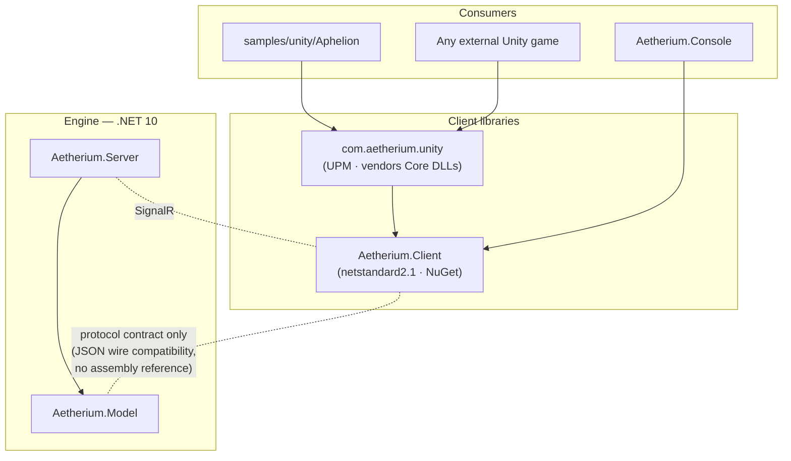

# Repo Structure: Client Libraries & Sample Games

*Part of the [Unity sample design suite](README.md). Status: proposed design, not yet implemented.*

This document defines where client libraries and sample games live in the Aetherium repository, how the Unity client library is packaged so **any** Unity game can consume it, and the migration path from today's layout.

## Goals

1. **A reusable client library, not a one-off client.** Any Unity-Aetherium game — ours or a third party's — installs one package and gets connection management, the protocol contract, and perception plumbing. The sample game contains only game-specific presentation and design.
2. **A home for many samples.** Unity, Unreal, and console samples sit side by side under one folder, each demonstrating the same engine through a different renderer — the proof of the engine's *render-agnostic* vision (see the root [README](../../../README.md#vision--goals)).
3. **The engine stays the center of gravity.** `Aetherium.Server`, `Aetherium.Model`, and `Data/Games/` bundles remain the repo's core. Clients and samples are satellites that consume the protocol; nothing in the engine references them.
4. **No new CI obligations.** Build validation for samples stays in local scripts (per standing project policy, no GitHub Actions workflows).

## Target layout

```
Aetherium/
├─ Aetherium.sln                      # engine + .NET clients (Unity projects are never in the .sln)
├─ Aetherium.Model/                   # shared engine contracts (unchanged)
├─ Aetherium.Server/                  # engine + Orleans silo + hubs (unchanged)
├─ Aetherium.Client/                  # NEW — transport-agnostic .NET client core (netstandard2.1 + net10.0)
├─ Aetherium.Client.Tests/            # NEW — client core unit tests + protocol drift tests
│
├─ clients/
│  └─ unity/
│     └─ com.aetherium.unity/         # NEW — Unity package (UPM) wrapping Aetherium.Client
│        ├─ package.json
│        ├─ Runtime/                  #   MonoBehaviour glue, main-thread dispatcher, theme binding
│        ├─ Runtime/Plugins/          #   vendored Aetherium.Client.dll + SignalR client DLLs
│        ├─ Editor/                   #   inspectors, theme-asset tooling
│        ├─ Tests/                    #   EditMode/PlayMode package tests
│        └─ Samples~/                 #   optional importable micro-samples (connect & render)
│
├─ samples/
│  ├─ README.md                       # what each sample demonstrates, how to run each
│  ├─ unity/
│  │  └─ Aphelion/                    # NEW — the sci-fi sample game (Unity 6 URP project)
│  ├─ unreal/
│  │  └─ README.md                    # placeholder → docs/clients/unreal-client-guide.md
│  └─ console/
│     └─ README.md                    # points at Aetherium.Console until it relocates (Phase C)
│
├─ Data/Games/
│  ├─ emberfall/                      # fantasy sample bundle (existing)
│  ├─ neonveil/                       # cyberpunk bundle stub (existing)
│  └─ aphelion/                       # NEW — the sci-fi game's server-side definition (YAML)
│
├─ Aetherium.Console/                 # stays put short-term; becomes a consumer of Aetherium.Client
├─ Aetherium.Unity/                   # legacy scaffold — superseded, removed after parity (Phase B)
└─ docs/design/unity-sample/          # this design suite
```

Two conventions worth stating explicitly:

- **A sample game is two halves in two places.** The *server half* is a YAML bundle under `Data/Games/<id>/` (creatures, items, rules, abilities — the game's meaning). The *client half* is a project under `samples/<engine>/<Name>/` (models, VFX, audio — the game's presentation). The shared vocabulary between them is the bundle's stable content ids (`creature: custodian`, `item: arc-cutter`, tile type ids). This split is the engine's data-driven principle made visible in the folder tree.
- **PascalCase for .NET projects, lowercase for grouping folders** — matching the existing split (`Aetherium.Server/` vs `docs/`, `scripts/`, `Data/`).

## Packaging: how a Unity game consumes Aetherium

### The two-layer library

| Layer | Artifact | Target | Contents |
|---|---|---|---|
| **Core** | `Aetherium.Client` (NuGet package) | `netstandard2.1` + `net10.0` | Connection lifecycle, protocol DTOs, typed tool invocations, local world mirror + delta application, reconnect policy. Zero Unity/engine-specific code — usable from console clients, Godot, test harnesses, and bots. |
| **Unity adapter** | `com.aetherium.unity` (UPM package) | Unity 6 LTS (works ≥ 2022.3) | Main-thread dispatch of SignalR callbacks, `AetheriumClientBehaviour` lifecycle component, grid↔scene mapping helpers, `ThemeAsset` (ScriptableObject binding content ids → prefabs/materials/audio), IL2CPP `link.xml`. Vendors the core DLLs under `Runtime/Plugins/`. |

Why two layers instead of one Unity package: the core is where the protocol logic lives, and protocol logic must be testable with plain `dotnet test` next to the server it talks to. The Unity adapter stays thin enough that its correctness is mostly "did callbacks reach the main thread and did prefabs spawn."

### Why UPM (not NuGet) for the Unity layer

Unity's native package manager is UPM; NuGet is not consumable in Unity without third-party tooling (NuGetForUnity). The UPM package is:

- **In-repo consumable** — the sample project references it by relative path in `Packages/manifest.json`:
  ```json
  "com.aetherium.unity": "file:../../../clients/unity/com.aetherium.unity"
  ```
- **Externally consumable** — any Unity game anywhere installs it via git URL with a path query, no registry required:
  ```json
  "com.aetherium.unity": "https://github.com/danvanderboom/Aetherium.git?path=clients/unity/com.aetherium.unity#unity-client/v0.1.0"
  ```
  Versioning is by git tag (`unity-client/v0.1.0`). If demand appears later, publishing to a scoped registry (e.g. OpenUPM) is additive — same package, no restructuring.

The **core** library ships as a normal NuGet package (`dotnet pack Aetherium.Client`) for non-Unity consumers, and is vendored as DLLs inside the UPM package for Unity (Unity resolves plain DLLs in `Runtime/Plugins/` without NuGet). The vendoring is automated by a script (`scripts/pack-unity-client.ps1`) that builds the core for `netstandard2.1`, copies its DLL plus the SignalR client dependency closure into `Runtime/Plugins/`, and stamps versions — run manually before tagging a client release.

### Dependency rules



The one deliberately unusual edge: **`Aetherium.Client` does not reference `Aetherium.Model`.** `Aetherium.Model` carries Orleans serialization attributes and an Orleans.Sdk dependency that must never be dragged into Unity. The client core instead defines its own mirror DTOs matching the JSON wire shape, and a **protocol drift test suite** in `Aetherium.Client.Tests` round-trips real server DTO instances through JSON into the client mirrors — the same generated-and-guarded pattern used for the ECA vocabulary docs. Drift breaks the build, not the game. (Full rationale and the schema-generation upgrade path: [unity-client-library.md](unity-client-library.md).)

## Migration path

Phased so nothing breaks mid-flight; each phase is independently shippable.

| Phase | What happens | Risk |
|---|---|---|
| **A — additive** | Create `Aetherium.Client` (+ tests) by extracting the console client's `Client/GameClient.cs` connection logic and defining mirror DTOs. Create `clients/unity/com.aetherium.unity` and `samples/` skeleton with READMEs. Add `Data/Games/aphelion/`. Nothing existing moves. | None — purely additive. |
| **B — supersede** | Build the Aphelion sample against the UPM package to feature parity with `Aetherium.Unity` (connect, join, render, move, interact), then delete `Aetherium.Unity/` and redirect `docs/unity/` to the package + sample docs. Its useful ideas (mock perception provider, input maps, PlayMode test patterns) are carried into the package first. | Low — the legacy project is a non-shipping scaffold outside the .sln. |
| **C — consolidate (optional, later)** | Point `Aetherium.Console` at `Aetherium.Client` for connection + DTO code (deleting its private copies), and optionally relocate it to `samples/console/`. | Medium — touches the reference client; do only when the core library is proven by the Unity sample. |

## Source-control hygiene for Unity content

- `.gitignore` additions for `samples/unity/**`: `Library/`, `Temp/`, `Obj/`, `Logs/`, `UserSettings/`, `*.csproj`, `*.sln` (Unity regenerates these), crash dumps.
- **Commit `.meta` files always** (Unity's asset identity lives there); enforce `Visible Meta Files` + `Force Text` serialization in project settings.
- **Binary assets policy:** the sample ships with deliberately small, license-clean assets (CC0 — see [art-audio.md](art-audio.md#asset-sourcing--licensing-repo-rules)). Git LFS is *not* adopted yet — it complicates cloning for a repo this size's audience. Revisit if `samples/` binary weight approaches ~100 MB.
- Unity version is pinned by the project's `ProjectSettings/ProjectVersion.txt`; the package's `package.json` declares the minimum (`"unity": "2022.3"`) so external consumers on older LTS aren't blocked artificially.

## What this unlocks

- **Unreal, later, follows the same shape:** `clients/unreal/AetheriumClient/` (however UE plugins are shaped) + `samples/unreal/<Game>/`, per the existing [Unreal client guide](../../clients/unreal-client-guide.md) — which already assumes a reusable C# client layer; `Aetherium.Client` *is* that layer.
- **Third-party games get a one-line install** and a worked example (Aphelion) showing every integration point.
- **The engine's sales pitch becomes a folder listing:** one server, one protocol, `Data/Games/*` bundles for meaning, `samples/*` renderers for presentation.
