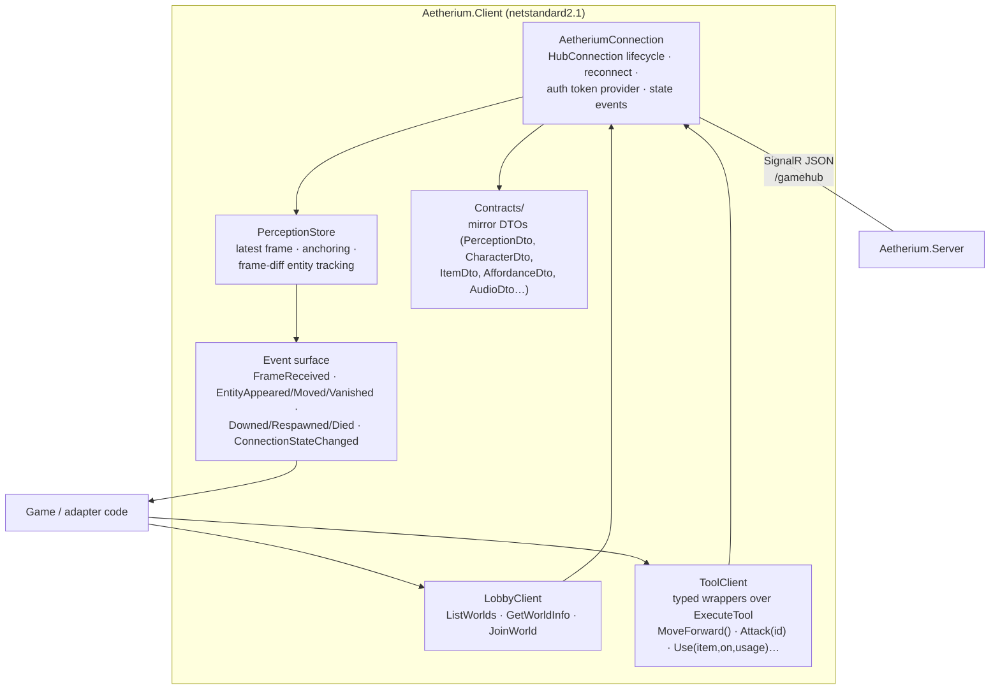
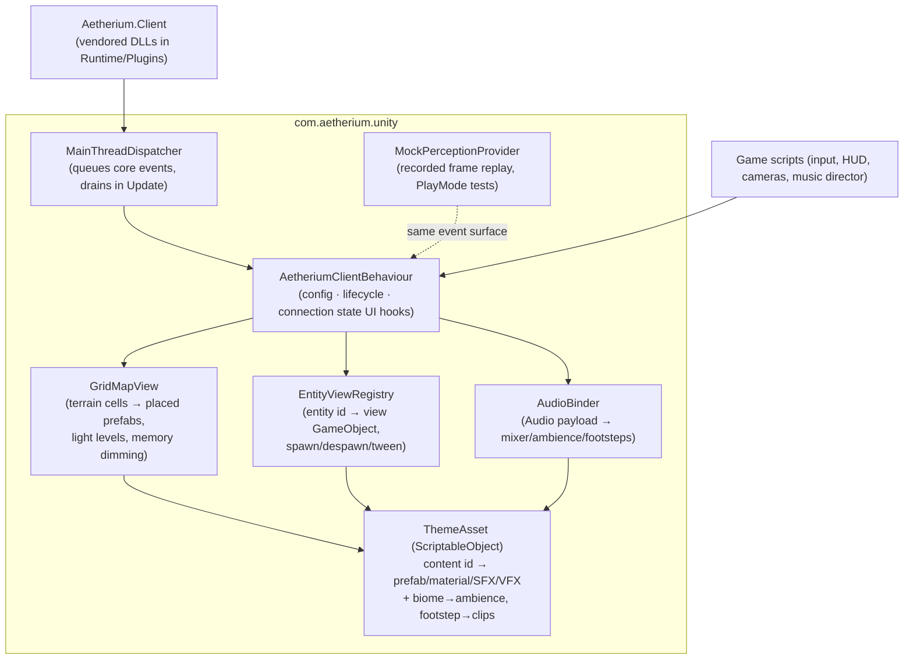
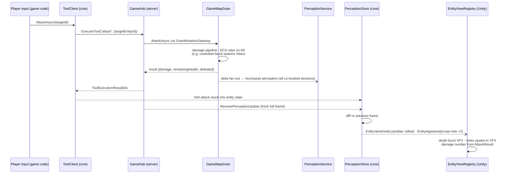

# Aetherium Unity Client Library

*Part of the [Unity sample design suite](README.md). Status: proposed design, not yet implemented.*

The client library is two artifacts — a pure-.NET core (`Aetherium.Client`) and a Unity package (`com.aetherium.unity`) that wraps it — giving any Unity game a supported path onto an Aetherium server: connect, join a world, receive perception, act, and bind everything visible to its own assets. Packaging and folder placement are covered in [repo-structure.md](repo-structure.md); this document is the technical design.

Everything below is grounded in the server's *actual* client surface (verified 2026-07-16 against `GameHub`, `PerceptionService`, the tool registry, and the console reference client), not the aspirational docs. Where the surface has sharp edges, the library's job is to absorb them so game code never feels them.

## The protocol, as it really is

| Fact | Consequence for the library |
|---|---|
| One gameplay hub: `/gamehub` (default `http://localhost:5000`), anonymous in dev, optional JWT (Azure AD B2C) in deployment | One connection object; auth is a pluggable token provider, absent by default |
| All actions go through `ExecuteTool(toolId, args)` → `ToolExecutionResultDto {Success, Message, Data?}`; legacy per-verb methods are gone | The library ships **typed wrappers** over tool ids; games never build arg dictionaries |
| World membership via `JoinWorld(worldId, mapId?)` (or `?worldId=` in the connection query string); `ListWorlds`/`GetWorldInfo` for discovery | A small **lobby client** is part of the core |
| Server pushes **full `PerceptionDto` frames** — on connect, after each of your actions, and whenever anything changes on your map (other players, NPC ticks ≈1 Hz). **No client-facing deltas.** | The client is a *frame consumer*: diff frames locally to derive appear/move/vanish events for views. No patch protocol to implement |
| **All coordinates are player-relative** — `PlayerLocation` is always `(0,0,0)`; `Visuals` keys are `"relX,relY,relZ"` strings | The library owns the **anchoring** solution (below) so games get stable world-space coordinates |
| Wire format: SignalR's default JSON (System.Text.Json), **PascalCase properties, enums as integers**, one tuple quirk (`AmbientTint` → `Item1/2/3`) | Mirror DTOs must match names and enum *order*; using the official SignalR client makes serialization symmetric |
| Entity identity: creatures surface as `CharacterDto` whose `Name`/`Tile.Name` is **`Creature:<contentId>`** (e.g. `Creature:custodian`) with glyph/colors in `Tile.Settings`; items as `ItemDto {Id, Label, Icon, KeyId, Location}` | Theme binding keys off the **content id** — the same id authored in the game bundle's `content.yaml` |
| Rich frame extras: `Inventory`, `Affordances` (available interactions with targets/keys/usage options), `NavigationData` (compass), lighting/vision modes, `GameTimeOfDay`, `Weather`/`Season`, and an `Audio` payload (`Biome`, `DangerLevel`, `ReverbPreset`, `Occlusion`, `AmbientEmitters`, `SuggestedMusicTrack`, `FootstepMaterial`) | The library exposes these as first-class events/state; the theme layer binds audio hints to mixers |
| Player lifecycle events: `ReceiveDowned` / `ReceiveRespawn` / `ReceiveDied` → `PlayerVitalsDto`; combat feedback rides `ExecuteTool("attack").Data` (`damage`, `remainingHealth`, `defeated`) | Vitals surface as events; the store folds attack results into per-entity presentation state (last-known HP) |
| Movement is **relative-only** (`F/B/L/R` + rotate) and coordinates are player-relative — a deliberate engine constraint: humans and AI agents act through the same embodied interface, and no client holds privileged absolute state | The library embraces it: a composite `MoveAsync(direction)` maps WASD onto the same rotate+step actions any agent could take, and the PerceptionStore owns anchoring (below) |
| Perception doesn't yet carry interoception (own vitals/pools/statuses) or social insight (others' condition/capabilities); the vision-mode wire enum is narrower than the tool advertises | Tracked in [engine-gaps.md](engine-gaps.md) as the G1/G2 perception channels and G5, with milestones |

### Player-profile tool catalog (what games can invoke)

`move`, `rotate`, `changelevel`, `pickup`, `drop`, `use` (with usage-option disambiguation), `open`, `close`, `attack`, `setlightingmode`, `setvisionmode`, `setfieldofview`, `toggledirectionalvision`, plus quest (`list_quests`, `accept_quest`, `quest_log`) and instance (`enter_dungeon`, `create_party`) tools. `ListAvailableTools` returns the schema at runtime — the library uses it in dev builds to assert its typed wrappers still match the server (a live drift check).

## Layer 1 — `Aetherium.Client` (pure .NET core)

Targets `netstandard2.1` + `net10.0`. Depends only on `Microsoft.AspNetCore.SignalR.Client`. No Unity, no engine assemblies. Everything testable with `dotnet test`.

**Why those two targets (verified against Unity's 2026 roadmap):** today's production Unity 6 LTS still runs Mono/IL2CPP with the **.NET Standard 2.1** API compatibility level — that is the current ceiling for any assembly shipped into Unity, so `netstandard2.1` is the Unity-facing target. Unity's CoreCLR back end is an experimental desktop-only preview as of 6.7 and explicitly not production-ready; with **Unity 6.8 (end of 2026) Mono retires and CoreCLR ships with full .NET 10 and C# 14**. When that lands, the same package flips its vendored DLLs to the `net10.0` build with zero restructuring — the dual-target core is deliberately positioned on both sides of Unity's runtime transition. (Sources: [Unity CoreCLR upgrade guide](https://discussions.unity.com/t/path-to-coreclr-2026-upgrade-guide/1714279), [June 2026 CoreCLR status update](https://discussions.unity.com/t/coreclr-scripting-and-serialization-update-june-2026/1723299), [Unity Manual — CoreCLR back end (experimental)](https://docs.unity3d.com/6000.7/Documentation/Manual/scripting-backends-coreclr.html).)



### Components

**`AetheriumConnection`** — owns the `HubConnection` (`WithUrl(baseUrl + "/gamehub")`, `WithAutomaticReconnect()`), registers the four inbound handlers (`ReceivePerceptionUpdate`, `ReceiveGameState`, `ReceiveDowned/Respawn/Died`), exposes connection-state events (Connecting/Connected/Reconnecting/Closed) and an optional access-token provider for deployed servers. The console client's `GameClient.cs` is the proven seed for this class and gets extracted rather than rewritten.

**`Contracts/`** — hand-written mirror DTOs matching the server's wire shape: same property names (PascalCase), same enum orders (`WorldDirection {North=0, South=1, East=2, West=3, Up=4, Down=5}` — note South before East), `AmbientTint` mirrored as a small struct with `Item1/2/3` mapping. The mirrors cover the *full* frame (the legacy Unity project's "Lite" DTOs dropped characters, items, inventory, affordances, and audio — which is why nothing could render; we don't repeat that).

*Why mirrors instead of referencing `Aetherium.Model`:* the model assembly carries Orleans.Sdk attributes and dependencies that must not enter Unity builds. The drift risk that killed the last shim attempt is retired structurally:

- **Protocol drift tests** live in `Aetherium.Client.Tests`, which references *both* assemblies (it runs server-side, so Orleans is fine there): construct representative server DTOs (including a fully-populated perception frame), serialize with the exact hub JSON options, deserialize into client mirrors, and assert field-level equality — plus a reflection sweep asserting every public property on each server wire DTO has a mirror counterpart. New server fields break the build, not the game.
- **A live schema check** (dev builds only) calls `ListAvailableTools` after connect and warns if the server's tool/parameter schema disagrees with the typed wrappers.

**`ToolClient`** — one method per player tool, args assembled internally, results typed:

```csharp
Task<ToolResult> MoveForwardAsync(int distance = 1);      // relative moves: F/B/L/R
Task<ToolResult> RotateAsync(bool clockwise);              // or RotateToAsync(degrees)
Task<ToolResult> MoveAsync(CompassDirection dir);          // composite: rotate-if-needed + forward (see note)
Task<ToolResult> ChangeLevelAsync(int delta);
Task<AttackResult> AttackAsync(string targetEntityId);     // parses damage/remainingHealth/defeated from Data
Task<ToolResult> PickupAsync(string targetEntityId);
Task<UseResult>  UseAsync(string itemId, string onEntityId, string? usageId = null); // surfaces usage options
Task<ToolResult> OpenAsync(string targetEntityId);         // + Close, Drop
Task<ToolResult> SetVisionModeAsync(VisionMode mode);      // + lighting mode, FOV, directional toggle
```

The composite `MoveAsync(CompassDirection)` is the WASD bridge over a *deliberate* engine constraint: the protocol only offers embodied, heading-relative movement, identically for humans and AI agents, so no client gets a privileged interface. The composite issues the minimal `rotate` + `move F` pair — exactly what any agent would do — and games that prefer full immersion can skip it and bind tank-style controls to the raw relative verbs.

**`PerceptionStore`** — the heart of the core. Responsibilities:

1. **Anchoring.** The server sends everything relative to the player and never reveals absolute coordinates. Games, though, need *stable* world-space positions — for tweening, for remembered-terrain rendering, for minimaps. The store maintains a client-side anchor: it starts at local origin and advances by the player's own successful movement results (move/changelevel); every incoming frame's relative offsets are added to the anchor to yield stable **client-space** coordinates. Discontinuities (portal use, respawn, join) re-anchor: the store detects them from the triggering call/event, wipes remembered geometry it can no longer trust (or re-bases it when the jump is known), and raises `Reanchored` so views can hard-cut instead of tweening across the map. Relative offsets are world-axis-aligned (north-up), not heading-rotated — an implementation-time assertion test pins this down against a live server.
2. **Frame diffing → entity lifecycle events.** Consecutive frames are diffed by entity `Id` across `VisibleCharacters`/`VisibleItems`: new id → `EntityAppeared`, moved id → `EntityMoved(from, to)`, missing id → `EntityVanished` (which means *left perception* — possibly died, possibly walked into darkness; the store does not pretend to know, but it folds in attack results, so a `defeated: true` on your own attack marks the vanish as a kill for presentation). Terrain cells get the same treatment (`CellRevealed`/`CellUpdated`), and a **memory layer** retains last-seen terrain per cell with a seen-timestamp so games can render explored-but-dark areas distinctly.
3. **Presentation state accumulation.** Per-entity scratch state that perception doesn't carry but presentation wants: last-known health (from attack results), last movement direction (for facing), first-seen time (for spawn-in VFX).

**`LobbyClient`** — `ListWorlds()`, `GetWorldInfo(id)`, `JoinWorld(id, mapId?)` (returns spawn info), `LeaveWorld()`. Creating *new* instances is operator-side today (`aetherctl game create` / management REST); a player-facing "host a station" call is [engine gap G6](engine-gaps.md).

**Threading contract:** the core is thread-agnostic and lock-protected; all events may fire on SignalR worker threads. It never touches a sync-context. Marshalling to a main thread is entirely the adapter's job — which is most of what the Unity layer *is*.

## Layer 2 — `com.aetherium.unity` (UPM package)



### What the package owns

- **`AetheriumClientBehaviour`** — the one component a game drops into a scene. Inspector config: server URL, world id (or "pick via lobby"), auto-connect. It owns an `AetheriumConnection`, pumps every core event through the **`MainThreadDispatcher`** (a simple thread-safe queue drained in `Update`; SignalR callbacks never touch Unity APIs directly), and re-raises them as UnityEvents/C# events for game code.
- **`GridMapView` + `EntityViewRegistry`** — subscribe to store events and materialize views: reveal terrain cells as placed prefabs, spawn entity views on `EntityAppeared`, tween on `EntityMoved` (duration scaled to the gap between frames so ≈1 Hz NPC steps read as deliberate motion, not teleports), play a vanish/death dissolve on `EntityVanished`, dim remembered cells. These are *defaults* — a game can replace either wholesale and talk to the store directly; Aphelion uses them as the base and layers its own VFX.
- **`ThemeAsset`** — the presentation contract, and the piece that makes the library game-agnostic. A ScriptableObject mapping:
  - creature content ids (`custodian`, from `Creature:custodian`) → entity prefab + death VFX + voice set,
  - terrain tile-type names → cell prefab/material,
  - item ids/icons → pickup prefab + inventory sprite,
  - `FootstepMaterial` → footstep clip set; `Biome` → ambience bed; `ReverbPreset` → mixer snapshot,
  - status ids (`burning`, `slowed`) → overlay VFX (forward-looking; statuses aren't on the wire yet — gap G2).

  Every lookup has a **fallback chain**: exact id → category default → loud placeholder (bright magenta capsule, never invisible). The legacy client's "everything renders invisible" failure mode is designed out.
- **`MockPerceptionProvider`** — offline development and PlayMode tests without a server, replaying recorded frame sequences (JSON) through the same event surface. The core gains a frame recorder so real sessions can be captured into fixtures — the legacy project's mock-first idea, kept, but fed by real data instead of a hand-authored frame that drifted.
- **IL2CPP/platform notes** — the package carries a `link.xml` preserving the contracts and SignalR client assemblies (reflection-bound JSON), pins the WebSockets transport, and documents the known-good platform set: Windows/macOS/Linux/iOS/Android. WebGL is explicitly out of scope initially (`System.Net.WebSockets` unavailable there; a bridge transport is a later item).

### What the package deliberately does *not* own

Input, cameras, HUD layout, music direction, game flow (lobby → run → score). Those live in the game (Aphelion's versions are described in [game-design.md](game-design.md) and [art-audio.md](art-audio.md)) — the library's event surface is designed so all of them are pure consumers.

## Sequence: from keypress to pixels

The full round-trip for one attack, including what a co-op partner sees ([architecture.md](architecture.md) has the join/bootstrap and multiplayer variants):



Latency hiding: input is optimistic only in *presentation* (attack wind-up animation starts immediately) — never in *state* (nothing moves or dies until the server says so). At the ≈100 ms action round-trip the spec targets, this reads as responsive without a reconciliation system.

## Testing strategy

| Layer | Tests |
|---|---|
| Core contracts | Protocol drift suite against `Aetherium.Model` (build-breaking), enum-order pins, anchoring unit tests (move/teleport/respawn sequences), frame-diff property tests |
| Core against server | Integration tests in `Aetherium.Client.Tests` booting the real server in-proc (the repo's `TestCluster` patterns): connect → join → move → assert frames, two-client visibility, reconnect mid-session |
| Unity package | EditMode: theme fallback chain, dispatcher ordering. PlayMode: mock-provider replay renders N cells/entities, tween/despawn behavior — no server required |
| Sample (Aphelion) | Scene smoke test against mock frames; manual co-op checklist per milestone ([milestones.md](milestones.md)) |

## Open implementation questions (tracked, not blocking)

1. **Relative-offset orientation** — assert world-axis alignment against a live server on day one (cheap test, big consequence if wrong).
2. **Respawn re-anchoring** — confirm what `PlayerVitalsDto`/the respawn flow reveals about the new location; if insufficient, the first frame after respawn re-anchors from scratch (memory wipe), which is acceptable for Aphelion (respawn = back at the dock).
3. **SignalR client DLL set for IL2CPP** — pin the exact dependency closure during Phase A and bake it into `pack-unity-client.ps1`; known workable, needs the specific version list validated in a Unity 6 IL2CPP build.
