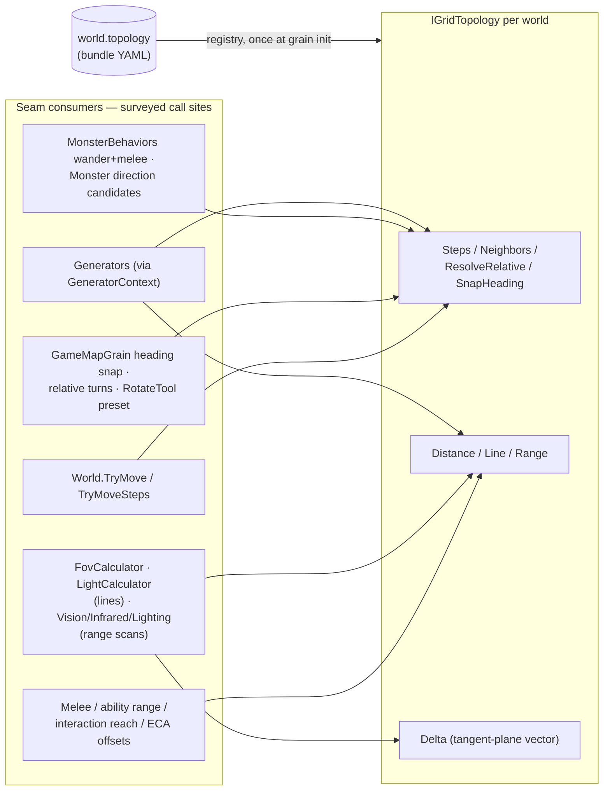

# Grid Topologies — Pluggable World Tilings (Square · Hex · Triangle · H3-ready)

*Status: **P0–P3 built, and the P1/P2 polish (dedicated hex generator, hex + triangle sample bundles, client layout math) shipped.** `Aetherium.Server/Topology/` ships `IGridTopology`/`SquareTopology`/`HexTopology`/`TriangleTopology`/`GridTopologyRegistry`; every surveyed call site routes through the seam; the `world.topology` config field is threaded end-to-end (default `"square"`); `PerceptionDto` carries `Topology` + `SelfCellParity`; the validator enforces generator↔topology support; a hex-native `HexCavesGenerator` and the `hexhaven`/`trigrove` sample bundles ship under `Data/Games/`; the console renderer and Unity `GridMapView` place cells through the shared `Aetherium.Model.GridCellLayout`; and the full suite (2220 tests) is green including golden-master square equivalence, hex/triangle end-to-end engine tests, layout-vs-embedding equivalence, and the [pentagon-mock](h3-topology.md#the-pentagon-mock-already-in-ci) CI guard. H3 itself is documented and staged (not implemented) in [h3-topology.md](h3-topology.md). Grounded in the 2026-07-16 engine survey. The hexagon-specific deep dive lives in [hexagonal-tiles.md](hexagonal-tiles.md); this document supersedes its interface sketch with the generalized abstraction.*

## The goal

Aetherium worlds should be able to declare their **tiling**: square (today's), hexagonal, triangular — and the abstraction must be shaped so that **Uber's H3** hierarchical geospatial grid (hexagons with 12 pentagons per resolution, multiple nested resolutions, spherical coverage of planets, moons, and planetoids) can be added later **without reshaping the abstraction again**. Topology, like every other configurable behavior in this engine, is **per-world data**:

```yaml
# game.yaml
world:
  topology: hex        # "square" (default) | "hex" | "tri" | (later) "h3"
  generatorType: hex-caves
  size: { width: 64, height: 64, depth: 3 }
```

A hex world, a triangle world, and Emberfall run side by side on one server; omitting the field means square, byte-identically.

## Why this is cheaper than it sounds

Two architectural facts (verified in the survey, detailed in [hexagonal-tiles.md](hexagonal-tiles.md#what-is-already-topology-agnostic-the-leverage)):

1. **World storage is coordinate-keyed** (`Dictionary<WorldLocation, …>`, `Core/World.cs:20,35`) — no `y*width+x` flattening exists anywhere. `WorldLocation(X,Y,Z)` reinterprets as hex axial `(q,r)` or triangle coordinates without a storage or wire change.
2. **Headings are integer degrees** with arbitrary-angle rotation (`Components/HasHeading.cs:17-21`, `GameMapGrain.cs:1837-1860`), the vision cone is dot-product angle math, and perception keys are opaque `"relX,relY,relZ"` strings — the *continuous* half of the engine never knew about squares.

What remains square is a finite, surveyed list: ~12 direction-table/Manhattan-distance call sites, the Bresenham line primitive inside FOV/lighting, rectangle scans, and the worldgen generators. That list is this design's work plan.

## The abstraction

New namespace `Aetherium.Topology` (folder `Aetherium.Server/Topology/`). Implementations are stateless singletons, resolved once at grain init from `WorldConfig.Topology` (the `ContentCompiler`/`EcaRuntime` compile-once pattern) onto a new `World.Topology` property.

```csharp
// Hot-path mirror of WorldLocation (which is a mutable class with string-based
// GetHashCode — a perf hazard topology math routes around). Convert at the seam
// boundary; WorldLocation's type, wire shape, and hashing are unchanged.
public readonly record struct GridCoord(int X, int Y, int Z);

// One outgoing edge of a cell. DirectionIndex is stable per (topology, cell)
// in-process but is NEVER persisted or sent on the wire — persist headings
// (degrees) or locations instead. HeadingDegrees = compass heading (0 = north,
// clockwise) of crossing this edge in the local embedding.
public readonly record struct EdgeStep(int DirectionIndex, GridCoord Target, int HeadingDegrees);

public readonly record struct RelativeMoveResolution(
    bool Success, EdgeStep Step, int NewHeadingDegrees, string? FailReason);

public interface IGridTopology
{
    string Name { get; }                 // "square" | "hex" | "tri" | (later) "h3"
    bool HasUniformDirections { get; }   // square/hex: true — enables table fast paths
    int MaxDirectionCount { get; }       // 4 / 6 / 3 / 6 — buffer sizing only

    // ---- per-cell direction machinery (the triangle/pentagon-proof core) ----
    int DirectionCount(GridCoord cell);
    EdgeStep GetStep(GridCoord cell, int directionIndex);
    IEnumerable<EdgeStep> Steps(GridCoord cell);
    IEnumerable<GridCoord> Neighbors(GridCoord cell);

    // ---- metric & geometry (same-Z; the Z axis stays engine-level) ----
    int Distance(GridCoord a, GridCoord b);                      // graph metric
    IEnumerable<GridCoord> Line(GridCoord a, GridCoord b);       // connected under Neighbors
    IEnumerable<GridCoord> Range(GridCoord center, int radius);  // exactly the Distance<=r ball

    // ---- heading machinery — degrees remain the engine-wide source of truth ----
    int SnapHeading(GridCoord cell, int degrees);   // nearest legal facing at this cell
    int TurnStepDegrees(GridCoord cell);            // 90 / 60 / 120 — rotate-preset granularity
    int? HeadingToDirectionIndex(GridCoord cell, int degrees);
    RelativeMoveResolution ResolveRelative(GridCoord cell, int headingDegrees,
                                           RelativeDirection move);

    // ---- local planar embedding for cones/falloff — the H3-proofing method ----
    // Vector from->to in the local tangent plane, in cell-size units. Planar
    // topologies: cell-center difference. H3 later: azimuthal projection of the
    // great-circle displacement. Only ever called at perception range — exactly
    // where a tangent plane is valid on a sphere.
    (double X, double Y) Delta(GridCoord from, GridCoord to);
}

// Planar-only extras (square/hex/tri — NOT implemented by H3). Worldgen and
// debug tooling may use absolute centers; runtime systems must use Delta.
public interface IPlanarGridTopology : IGridTopology
{
    (double X, double Y) CellCenter(GridCoord cell);
}

public static class GridTopologyRegistry
{
    public static IGridTopology Get(string name);   // "square" default; throws on unknown
    public static bool TryGet(string name, out IGridTopology topology);
    public static IReadOnlyCollection<string> Names { get; }
}
```

### The two structural rules that make it general

**Rule 1 — every direction query takes the cell.** Uniform grids don't need it; the grids we're protecting the future for do:

| Topology | Neighbors | Direction set | Notes |
|---|---|---|---|
| Square | 4, uniform | N/E/S/W (table) | `HasUniformDirections` fast path |
| Hex (axial) | 6, uniform | 6 × 60° (table) | fast path |
| **Triangle** | **3, parity-dependent** | up-cells (`(X+Y)&1==0`) cross edges at `{60°,180°,300°}`; down-cells at `{0°,120°,240°}` | the generalization proof |
| **H3** | **6, except 12 pentagons with 5** | per-cell via H3 library | same machinery, zero new concepts |

**Rule 2 — all relative movement resolves angularly against degree headings.** `ResolveRelative(cell, heading, move)` computes the target angle (`F=+0°, R=+90°, B=+180°, L=+270°` — the existing 4-value `RelativeDirection` wire enum is kept unchanged on *every* topology), picks the outgoing edge nearest that angle, with deterministic tie-breaks: (a) toward forward, then (b) clockwise. It returns the chosen edge and the new heading (= the edge's heading); the caller decides whether the actor's heading updates. Consequences:

- **Square** — exact everywhere; byte-identical to today's `DegreesToCardinal`/`RotateRelativeByHeading` (`GameMapGrain.cs:3117-3149`), pinned by golden tests.
- **Hex** — F/B exact (every hex edge has an opposite); L/R resolve to the ±60° "forward-side" edges via tie-break (a); turn preset becomes 60°.
- **Triangle** — headings snap server-side to the current cell's three edge headings (`SnapHeading`); the turn preset is 120° (cycling the cell's own edges — 60° would face a non-edge). Forward is always exact after snapping. **Backward genuinely has no opposite edge**: heading+180° lands exactly between two edges and even tie-break (a) ties, so (b) picks the clockwise one — documented, deterministic, golden-tested. Crossing an edge flips parity, and the returned heading is automatically legal in the destination cell (the shared edge exists on both sides), so headings never desync.
- **H3 pentagon** (later) — the missing sixth edge simply isn't a candidate. No new machinery.

### Invariants (the property-test harness)

Every implementation — including a deliberately irregular CI mock (see P3) — must pass:

1. **Neighbor symmetry**: `b ∈ Neighbors(a) ⇔ a ∈ Neighbors(b)`; every edge has a reverse edge.
2. **`Distance` is a true metric**, with `Distance(a,b)==1 ⇔ adjacent`.
3. **`Range(c,r)` is exactly** `{ x : Distance(c,x) ≤ r }`.
4. **`Line(a,b)` is connected** under `Neighbors`, starts at `a`, ends at `b`.
5. `3 ≤ DirectionCount(cell) ≤ MaxDirectionCount ≤ 8`; callers never assume it constant.
6. **Direction indices are ephemeral** — never persisted, never on the wire (headings/locations are).
7. Edge `HeadingDegrees` is consistent with `Delta(cell, edge.Target)`.
8. **Topology governs XY only** — the Z axis (levels, stairs, lifts) is orthogonal and untouched.

## Cell identity: `WorldLocation` stays (with the H3 packing plan on record)

`WorldLocation(int X,Y,Z)` remains the universal cell key across storage, protocol, deltas, and persistence through P0–P2: hex uses axial `(q,r)` in X/Y; triangle derives parity from `X+Y`. Introducing an opaque `CellId` now would churn Orleans schemas, the SignalR protocol, and `MapState` persistence for zero in-scope benefit.

**H3 packs losslessly when its day comes**: a valid H3 index's top bit is reserved-zero, so `X = (int)(index >> 32)` is always non-negative and `Y = (int)(index & 0xFFFFFFFF)` round-trips exactly — `Z` stays the vertical level, and `WorldLocation`'s three-int wire shape never changes. For player-relative perception on a sphere (where "relative delta" has no global meaning), H3's `cellToLocalIj` yields perceiver-anchored local coordinates: perception keys become `"relI,relJ,relZ"`, preserving the opaque-string, no-absolute-coordinates contract. (`cellToLocalIj` is valid within a base-cell neighborhood — comfortably beyond perception radii — and is marked experimental upstream; recorded as a P3 dependency note.)

P0 guardrail: `WorldLocation.X/Y` get doc-comments declaring them **topology-interpreted opaque integers**, and the `Delta`/`CellCenter` split keeps geometry consumers off raw X/Y arithmetic.

## H3: how much of a stretch?

Directly answering the question — **given this abstraction, H3 is an implementation, not a redesign.** The four things H3 adds, and where each lands:

| H3 property | Where it lands | Stretch |
|---|---|---|
| 12 pentagons per resolution (5 neighbors) | Rule 1 (per-cell direction sets) — same as triangle parity | None — designed for |
| 64-bit hierarchical cell index | The documented `WorldLocation` packing (above) | Small, deferred |
| Spherical geometry (no global plane) | `Delta` as azimuthal projection; `Line`/`Range` via `h3Line`/`gridDisk`; falloff on tangent-plane distance | Contained in one class |
| Multiple resolutions | `IHierarchicalGridTopology : IGridTopology { Resolution(cell); Parent(cell); Children(cell); }` implemented **only** by H3; one resolution per map; **cross-resolution travel is the existing topology-agnostic portal system** linking maps at different resolutions; client zoom is rendering-only | The real design work, and it maps onto existing engine concepts |
| Planetary/lunar coverage | A world whose map *is* a shell of H3 cells at resolution R over a body — worldgen samples elevation/biome noise on the sphere | New generator, same pipeline |

Dependency: [`pocketken.H3`](https://github.com/pocketken/H3.net) — a maintained pure-C# port of H3 v4 (Apache-2.0, NuGet, netstandard2.0/2.1+; no native interop). Nothing in the solution references it today. Risks: small maintainer community, .NET 10 compatibility unverified; fallback is vendoring the minimal index-math subset behind the topology seam.

## Wiring: the seventh application of the config-threading recipe

`topology` threads exactly like death/abilities/progression/factions/content/eca before it: `GameWorldDefinition` (new `[Id]`, default `"square"`) → `WorldTemplate` → `WorldConfig` + `CreateWorldRequest` → `GameDefinitionMapper` → `GameManagementGrain.CreateWorldAsync` (both paths) → `OrleansWorldHost` → `WorldGrain` state → `GameMapGrain.InitializeAsync` **and** `OnActivateAsync` (reactivation resolves from persisted `MapState.Topology`) → `World.Topology`, plus `GeneratorContext.Topology` for worldgen. All Orleans `[Id(n)]`s append-only; every new field defaults `"square"` so pre-topology persisted state reactivates correctly.



## Phased backlog

### P0 — the seam *(size M; square-only; zero behavior change)* — ✅ **built**

Create `IGridTopology` + `SquareTopology` + `GridTopologyRegistry` + the property harness. Route the surveyed call sites: `World.TryMove`/`TryMoveSteps` (`Core/World.cs:277-302,431-477`), `Monster.GetValidCardinalDirections` (`Entities/Monster.cs:97-120`), legacy `GameSession.MoveView` (pinned to square), `GameMapGrain` heading-snap/relative-turn (`:3117-3149`), melee (`:2296-2302`), ability range (`:2436-2439`), ECA spawn offsets (`:2168-2181`), `MonsterBehaviors.cs:81-103`, `InteractionSystem.cs:160-172`, `FovCalculator`/`LightCalculator` lines (square `Line` *is* today's Bresenham, moved verbatim), `VisionSystem`/`InfraredVisionSystem`/`LightingSystem` rectangle scans → `Range` (behavior-pinning snapshots resolve rectangle-vs-disc questions in favor of today's output), `Extensions.cs:22-56` + `HasHeading.ToWorldDirection` marked square-legacy, `RotateTool` preset → `TurnStepDegrees`. Thread the config field; validator accepts only `"square"`.
**Gate:** the full existing test suite green, untouched, plus golden-master equivalence tests for every rewritten table.

### P1 — hexagon *(M/L)* — ✅ **built, including the polish**

**Built:** `HexTopology` (pointy-top axial coords, cube distance, cube-lerp lines, hex-disc ranges, 60° facings at {30,90,150,210,270,330}°, normalized embedding so adjacent centers are exactly 1 unit apart — FOV/light range stays comparable to square) is registered and passes the 8-invariant harness, Red Blob golden cases, and **end-to-end tests that run the unchanged engine** (`World.TryMoveSteps`, `FovCalculator`) over a hex world: forward walks the east edge, Right-of-east takes the `(0,+1)` hex diagonal no square cardinal could reach, movement stops at the disc edge, and FOV respects hex distance. The validator accepts `"hex"` (it checks the registry, which now knows it). `ITopologyAwareGenerator { SupportedTopologies }` is the opt-in seam a generator uses to declare tilings; non-implementers are implicitly square-only, so existing generators are untouched.

**Polish shipped:** [`HexCavesGenerator`](../Aetherium.Server/WorldGen/Generators/HexCavesGenerator.cs) declares `SupportedTopologies=["hex"]` and carves cellular-automata caves *on the hex lattice itself* — a hex-shaped disc with a solid rim, six-way CA smoothing, and a largest-connected-region flood-fill so no floor cell is stranded (`HexCavesGeneratorTests`). The [`GameDefinitionValidator`](../Aetherium.Server/Games/GameDefinitionValidator.cs) now resolves the chosen generator and **errors when its `SupportedTopologies` don't include the world's tiling** (both directions: a square generator on `hex`, and hex-caves on a square world). The [`hexhaven`](../Data/Games/hexhaven/game.yaml) sample bundle (`topology: hex`, `generatorType: hex-caves`) ships under `Data/Games/` and is covered by the shipped-bundle registry canary. Client layout is in P6. Full hex rationale: [hexagonal-tiles.md](hexagonal-tiles.md).

### P2 — triangle *(M)* — ✅ **built**

**Built:** `TriangleTopology` — parity machinery (`(X+Y)&1` picks up-cell edges {60,180,300}° vs. down-cell {0,120,240}°; `HasUniformDirections=false`, `MaxDirectionCount=3`), BFS distance and BFS-ring ranges (the triangular metric has no simple closed form — the ±X moves alternate axes by parity — so BFS is the reference implementation, a closed-form metric is a future optimization behind the same interface), BFS-guided greedy-descent lines (connected, hits both endpoints, straightness tie-break), `SnapHeading` to the cell's own three edges, 120° turns. Passes the 8-invariant harness (including the heading↔`Delta` consistency check that validates the derived `CellCenter`), the parity direction proof, BFS-distance-vs-independent-reference, and the signature case — **Backward from an up-cell has no opposite edge, so it resolves deterministically clockwise to the 300° edge** (tie-break (a) toward-forward also ties, so (b) decides). An end-to-end test crosses a real triangle edge through `World.TryMoveSteps` and lands in a down-cell. `PerlinTerrainGenerator` now declares `SupportedTopologies=["square","hex","tri"]` (continuous noise is the free any-lattice terrain). Protocol: `SelfCellParity` (0/1) added to `PerceptionDto` alongside a `Topology` name string, populated by `PerceptionService` — the one bit relative deltas can't convey on a triangle world (which way the perceiver's own triangle points), null on square/hex.

**Polish shipped:** the [`trigrove`](../Data/Games/trigrove/game.yaml) sample bundle (`topology: tri`, `generatorType: perlin-terrain`) ships under `Data/Games/` and is covered by the registry canary; client-side triangle layout + parity rendering is in P6.

### P3 — H3 stage-setting *(S; doc + one test artifact)* — ✅ **built**

**Built:** [docs/h3-topology.md](h3-topology.md) records the full stage-setting — the `WorldLocation` packing (H3's reserved top bit makes the 64-bit index split lossless), `cellToLocalIj` perception keys (preserving the opaque-string, no-absolute-coordinates contract on a sphere), hierarchy-via-portals posture, `Delta`-as-azimuthal-projection, worldgen by cell-center noise, and the `pocketken.H3` dependency assessment with a vendoring fallback. **Plus the one code artifact**: [`PentagonishTopology`](../Aetherium.Test/Topology/PentagonishTopology.cs) — an intentionally irregular grid (y-even rows are 5-neighbor pentagons, y-odd rows 6-neighbor hexagons, cut symmetrically so neighbor symmetry holds) — runs through the [8-invariant harness](../Aetherium.Test/Topology/GridTopologyInvariants.cs) in CI as the permanent guard that no uniform-direction (or global-plane) assumption regresses into the seam before H3 is written.

### P6 — client layout math *(S)* — ✅ **built**

**Built:** [`Aetherium.Model.GridCellLayout`](../Aetherium.Model/GridCellLayout.cs) is the one shared, unit-tested implementation of "where does a relative cell land on screen," consumed by every renderer so screen adjacency matches topological adjacency. It has two faces: a **character-grid** face for the console (cell width in chars — 2 for square/hex, 1 for triangle; per-row honeycomb stagger for hex; a cell-index↔relX mapping that stays aligned across negative rows) and a **continuous** face (`CellLayoutPosition`) for pixel renderers that returns each cell's center *in cell units, relative to the perceiver's own cell*, exactly mirroring the server topologies' `CellCenter` embeddings — proven by `GridCellLayoutTests`, which asserts the client positions equal `HexTopology`/`TriangleTopology.Delta` to 1e-9. The reference console renderer ([`ClientConsoleMapView`](../Aetherium.Console/Views/ClientConsoleMapView.cs)) now drives both its live draw loop and its monitoring capture through the helper, keyed off `PerceptionDto.Topology`/`SelfCellParity`; the Unity client library's `GridMapView` uses the same helper (design suite, [unity-client-library.md](design/unity-sample/unity-client-library.md)). Triangle cell orientation (up/down) is derived client-side as `(SelfCellParity + relX + relY) mod 2`, the one bit the server sends because relative deltas alone can't convey it.

## YAML, validator, worldgen, protocol

- **Bundle:** `world.topology:` optional string, default `"square"` — Emberfall, Neonveil, and Aphelion are untouched and byte-identical.
- **Validator:** topology must be in the registry (error); the chosen generator must support it (error).
- **Worldgen compatibility:** optional `ITopologyAwareGenerator { IReadOnlyCollection<string> SupportedTopologies }`; generators that don't implement it are implicitly `["square"]` — zero edits to existing generators; checked at bundle load and again at `CreateWorldAsync`.
- **Protocol:** `Topology` (string) and `SelfCellParity` (int?, tri only) ship on `PerceptionDto` so clients pick their layout math. Unchanged: `Visuals` relative keys, `RelativeDirection`, `VisibleBounds` (still the axial bounding box). `WorldDirection` remains as square-world cosmetics; **degrees are the documented source of truth**. Per-topology cell layout (axial→screen/world transforms, mesh orientation) is client-side but lives in **one shared, unit-tested place** — `Aetherium.Model.GridCellLayout` (P6) — consumed by both the console `ClientConsoleMapView` and the Unity library's `GridMapView` ([design suite](design/unity-sample/unity-client-library.md)).

## Test plan

- **P0:** golden-master equivalence for every rewritten direction/distance table + ASCII FOV fixtures captured *before* refactoring; the existing full suite as the regression net.
- **Every topology:** the 8-invariant property harness; per-topology golden cases (Red Blob hex references; triangle parity-flip and tie-break tables); FOV symmetry tests.
- **Config:** validator tests (unknown topology, generator mismatch, omitted→square); Orleans round-trip + grain reactivation tests for the new field; per-topology bundle-boot integration tests.

## Non-goals

No conversion of existing square content; no mixed topologies within one map; no H3 implementation or dependency now; no client rendering implementation; no pathfinding rework beyond neighbor substitution; no change to `WorldLocation`'s type, wire shape, or hashing; no FOV architecture change (per-cell raycast stays).

## Risk register

| Risk | Mitigation |
|---|---|
| P0 behavior drift across 12+ rewritten call sites | Golden masters captured before each refactor; full-suite gate; ambiguities resolved in favor of today's output |
| Orleans serialization breakage (Id reuse; pre-topology persisted state) | Append-only `[Id]`s; `"square"` defaults everywhere; round-trip + reactivation tests |
| Hot-path perf (`WorldLocation` string hash; enumerator allocation in FOV loops) | `GridCoord` struct for all topology math; uniform-direction table fast paths; FOV benchmark before/after P0 |
| Game-feel disputes (hex L/R, triangle Backward) | All semantics live in one method (`ResolveRelative`) with documented deterministic tie-breaks; degrees-first protocol lets clients build richer turn UIs without server changes |
| H3 lock-in (a hidden uniform-grid or global-plane assumption surviving to the H3 phase) | Per-cell direction APIs only; `Delta` not `CellCenter` in runtime systems; direction indices banned from persistence/wire; the CI pentagon-mock harness |

## Asset note

Tiling changes touch only *structural* tile assets — characters, creatures, props, and audio are grid-agnostic (see [hexagonal-tiles.md](hexagonal-tiles.md#asset-impact-summary--full-analysis-in-assetsmd) for the hex asset landscape: good CC0 terrain packs exist; sci-fi interiors are make-in-project either way). Triangle tiles have essentially **no** free-pack ecosystem — a triangle world's kit is make-in-project by necessity, though it's tiny (one up-tri floor, one down-tri floor, one edge wall). H3 planetary worlds would be procedural terrain, not kit-based.

## When to pull this

Not before the Aphelion sample ships its M0 (per project direction). The cheap insurance meanwhile, unchanged from the hex doc: route any *new* adjacency/distance code through the central helpers rather than adding inline offset math, and keep degrees as the heading source of truth in everything new. When a game concept actually wants hex (tactics, overworld) or H3 (planetary survey, moon bases — the user has already run H3 on lunar coordinates), P0 is the first slice pulled, and it pays for itself in regression safety even if no second topology ever ships.
